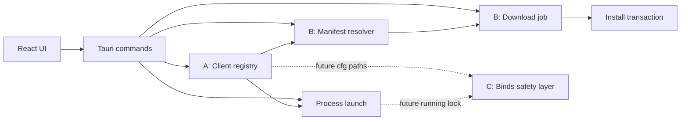

## 速答

当前 Rust 后端已经具备 Tauri command 入口、手动客户端验证、manifest 读取校验、cfg 解析、Workshop JSON 拉取和启动客户端的基础能力，但仍缺少支撑真实启动器的两个核心闭环：本地客户端注册表与真实更新下载事务。

因此后端强化应优先做 A+B：先建立客户端发现、识别、持久化和默认客户端选择；再接真实 manifest 选择、下载、sha256 校验、解压、安装事务和回滚点。C，也就是 Binds 安全写入，当前已有解析和 Manager 区块渲染基础，但应后置为独立阶段，只在 A+B 中预留运行状态和路径接口。

## 关键证据

| # | 结论 | 证据 | 位置 |
|---|------|------|------|
| 1 | command 层仍有 mock 更新与下载 | `check_update` 返回模拟版本信息，`start_download` 模拟进度事件，`launch_game` 仅打印日志 | `src-tauri/src/commands.rs:45`, `src-tauri/src/commands.rs:66`, `src-tauri/src/commands.rs:107` |
| 2 | 当前客户端能力是手动目录验证，不是扫描注册表 | `validate_client_dir` 只接收一个 `Path`，检查 `DDNet.exe`、`storage.cfg`、`data` | `src-tauri/src/client_scan.rs:15`, `src-tauri/src/client_scan.rs:20` |
| 3 | 当前客户端分类写死为 QmClient | 返回模型中 `client_id: "qmclient"`，没有 DDNet Vanilla、Nightly 或第三方分类逻辑 | `src-tauri/src/client_scan.rs:30` |
| 4 | manifest 校验已有安全基础 | manifest host 与 asset host 有 allowlist，并校验 HTTPS/public host、字段、sha256、size | `src-tauri/src/manifest.rs:7`, `src-tauri/src/manifest.rs:8`, `src-tauri/src/manifest.rs:16`, `src-tauri/src/manifest.rs:70`, `src-tauri/src/manifest.rs:136` |
| 5 | proxy/mirror 策略还不完整 | `build_manifest_url` 拼接 `proxy_base_url + url` 后仍对最终 host 套 manifest allowlist，通用镜像会被拒绝 | `src-tauri/src/manifest.rs:34` |
| 6 | 下载模块尚未形成下载事务 | `download.rs` 当前只有 `sha256_hex`，没有 streaming download、临时文件、断点续传、安装、回滚 | `src-tauri/src/download.rs:4` |
| 7 | 启动安全检查已有基础，但没有运行态管理 | `resolve_launch_target` 校验目标文件名和完整客户端目录，`launch_executable` 只 spawn，不跟踪 pid 或运行状态 | `src-tauri/src/process.rs:18`, `src-tauri/src/process.rs:60` |
| 8 | 领域模型缺少 A+B 所需状态模型 | 现有模型覆盖 `ClientInstallation`、`UpdateManifest` 和 Bind/Workshop，但没有扫描结果、下载任务、安装事务、设置持久化模型 | `src-tauri/src/models.rs:19`, `src-tauri/src/models.rs:46`, `src-tauri/src/models.rs:74`, `src-tauri/src/models.rs:135`, `src-tauri/src/models.rs:150` |

## 探索范围

- 聚焦目录：`src-tauri/src/`
- 涉及文件：`commands.rs`、`client_scan.rs`、`manifest.rs`、`download.rs`、`process.rs`、`models.rs`、`file_tx.rs`、`workshop.rs`
- 辅助文件：`src/lib/tauri.ts`、`src/types.ts`、`docs/superpowers/specs/2026-06-06-ddnet-manager-prd.md`
- 跳过：真实运行 `make tauri-dev` 和网络下载联调，因为本次目标是后端设计探索，不执行实现验证。

## 置信度说明

**confidence: high**

- 已覆盖当前 Rust 后端入口、领域模型、客户端验证、manifest、下载、进程、Workshop 和文件事务基础模块。
- 结论来自具体代码位置，而不是基于 PRD 推测。
- 未覆盖的部分主要是运行时行为和真实网络环境，这不会影响“当前代码缺少哪些后端能力”的判断。

## 后续建议

基于这份探索，可以把后端强化拆成“客户端注册表与扫描”和“真实更新下载事务”两个优先阶段，Binds 写入安全作为第三阶段独立设计。
