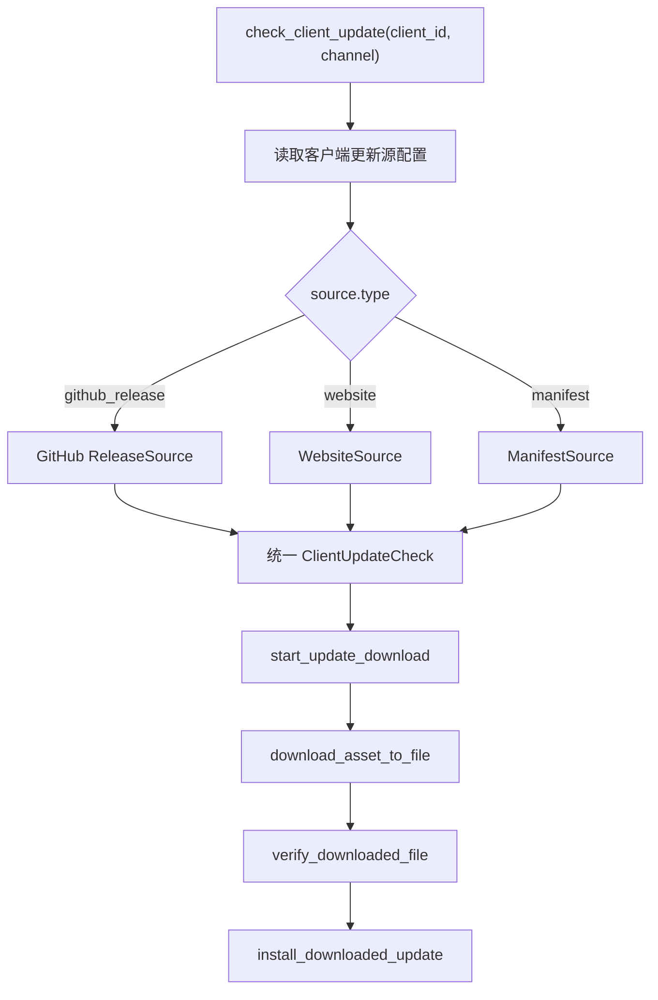

# DDNet Manager GitHub 更新源 MVP 与 Gitee 托管调查

## 速答

当前代码已经偏向“项目自维护 manifest”：更新页要求手动输入 manifest 地址，后端 `check_client_update` / `start_update_download` 也要求显式传入 manifest。结合新的产品方向，MVP 更适合调整为：**GitHub Release 检测作为主链路，manifest / Gitee 只作为可选加速或备用方案**。

推荐 MVP 流程：

```text
客户端类型配置
  ├─ GitHubReleaseSource：大多数客户端
  ├─ WebsiteSource：cactus client
  └─ ManifestSource：可选，不作为第一版硬依赖
        ↓
检查更新
        ↓
选择 asset
        ↓
下载 / 校验 / 安装
```

这样能避免第一版就依赖额外服务器或静态托管服务。GitHub 上的客户端可复用 release / tag 下载；cactus client 因为是独立网站且不开源，需要单独 `website` 更新源。

## 关键证据

1. `src/components/update/UpdatePanel.tsx:92` — 前端更新页当前 `manifestUrl` 初始值为空，不再内置默认 manifest 地址。

2. `src/components/update/UpdatePanel.tsx:189-207` — 前端检查更新前要求 manifest 地址非空，然后把 `manifest_url` 传给 `checkClientUpdate`。

3. `src-tauri/src/commands.rs:129-134` — 后端 `check_client_update` 通过 `required_manifest_url(request.manifest_url.as_deref())?` 强制要求 manifest。

4. `src-tauri/src/commands.rs:197-209` — 后端 `start_update_download` 同样先读取 manifest，再根据 manifest 中的 asset 构造下载 URL。

5. `src-tauri/src/manifest.rs:9-10` — manifest host allowlist 当前只允许 `raw.githubusercontent.com`；asset host 仍按 GitHub / trusted hosts 校验。

6. `src-tauri/src/download.rs:194-210` — 下载后已有 size 和 sha256 校验能力，后续 GitHub Release 更新源只需要提供统一的 `ClientUpdateCheck`。

7. `src-tauri/src/network_route.rs:118-133` — 现有网络路由探测围绕 manifest 设计，说明当前加速链路仍以 manifest URL 为入口，而不是 GitHub release discovery 为入口。

## MVP TODO

### P0：新增更新源模型

新增 `UpdateSource`，至少支持：

```text
github_release
website
manifest
```

建议配置结构：

```json
{
  "client_id": "qmclient",
  "source": {
    "type": "github_release",
    "owner": "example",
    "repo": "qmclient",
    "asset_patterns": ["windows", "x86_64", ".zip"]
  }
}
```

`manifest` 保留为可选 source，不再作为 MVP 唯一入口。

### P0：实现 GitHub Release 检测模块

新增后端模块，例如 `github_release.rs`：

- 调 GitHub releases API。
- 读取 latest release 或按 channel 过滤 release / tag。
- 解析 `tag_name`、`prerelease`、`assets`。
- 按 `asset_patterns` 匹配 Windows zip。
- 输出统一 `ClientUpdateCheck`。

GitHub release asset API 返回结构包含 `browser_download_url`、`size` 等字段；如果 release asset 里提供 `digest`，可用于 sha256 来源。参考：<https://docs.github.com/rest/releases>

### P0：改造 `check_client_update`

当前 `check_client_update` 只能读 manifest。MVP 后应改成：

```text
check_client_update(client_id, channel)
  → 读取客户端 source 配置
  → github_release / website / manifest 分派
  → 返回统一 ClientUpdateCheck
```

前端不应要求用户必须输入 manifest 地址。

### P0：保留现有下载事务

下载执行层已经具备：

- 缓存目录下载。
- 临时文件。
- 进度事件。
- size / sha256 校验。
- zip staging。
- 安装事务。
- 回滚点。

因此这次 MVP 主要补“更新发现来源”，不是重写下载链路。

### P1：GitHub API 缓存和限流处理

GitHub 未认证 REST API 有限流，官方文档说明未认证请求按 IP 限制。参考：<https://docs.github.com/en/rest/using-the-rest-api/rate-limits-for-the-rest-api>

MVP 建议：

- 检查结果缓存到 SQLite。
- 相同 repo 短时间内不要重复请求。
- 网络失败时显示“更新检查失败”，不要持续重试。
- GitHub token 作为高级设置，不作为默认要求。

### P1：cactus client 使用 WebsiteSource

补充资料指出 cactus client 是网站下载且不开源，不能套 GitHub 逻辑。

MVP 可以先支持：

- 固定下载页 URL。
- 版本未知或手动版本。
- UI 提供“打开下载页”或后续再做网站解析。

不要强行把 cactus client 塞进 GitHub ReleaseSource。

### P2：Gitee 跑通路径调查

Gitee 可以作为免费 manifest / mirror 候选，但不建议直接作为 MVP 主路径。需要实测后再决定。

已知信息：

- Gitee Pages 帮助分类已标注 Pages / Pages Pro 功能下线。参考：<https://gitee.com/help/categories/56>
- Gitee 有 release / 附件能力，社区工具 `gitee-release-cli` 支持创建 release 和上传附件，但需要 token。参考：<https://gitee.com/gitee-frontend/gitee-release-cli/blob/master/README.md?skip_mobile=true>
- Gitee OpenAPI v5 存在，SDK 文档围绕 `https://gitee.com/api/v5`。参考：<https://gitee.com/sdk/gitee5j/blob/main/docs/RepositoriesApi.md>

需要跑通的实测项：

1. 建一个公开测试仓库。
2. 放一个 `manifest.json`。
3. 测试仓库 raw 文件 URL。
4. 测试 release 附件 URL。
5. 测试 API 获取 release 附件。
6. 用 `curl -L` 和 Rust `reqwest` 测，不使用浏览器 cookie。
7. 确认是否需要登录。
8. 确认是否跳中间页或需要验证码。
9. 确认是否限流或防盗链。
10. 确认 manifest 小文件是否稳定。
11. 确认 zip 大文件是否适合下载。
12. 确认内容审核或外链策略是否影响发布。

只有 raw / release 附件都能无认证稳定访问后，才适合把 Gitee 作为 `ManifestSource` 或 `MirrorSource`。

## 架构建议



## 结论

第一版不建议继续把 manifest 作为唯一更新入口。更合理的 MVP 是：

- GitHub release/tag 更新源为主。
- cactus client 走 website 更新源。
- manifest 保留为可选扩展。
- Gitee 先做跑通调查，不作为主路径。
- 下载、校验、安装事务继续复用当前实现。

confidence: medium-high。代码侧证据充分；Gitee 侧尚未实际 curl / reqwest 跑通，因此只给出待验证路径，不把它判断为可用方案。
