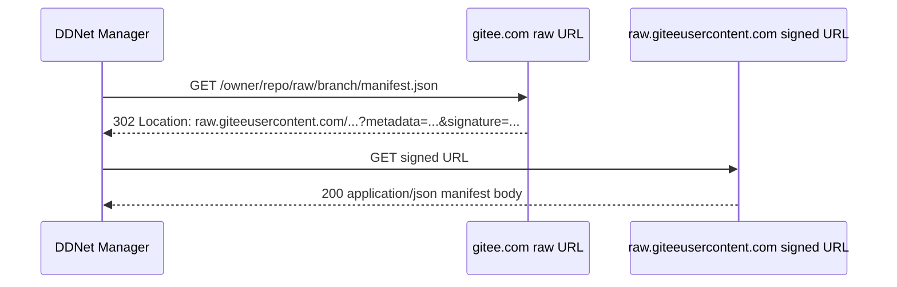

# Gitee 托管 manifest.json 可用性调研

## 速答

Gitee 可以用于托管 DDNet Manager 的小型 `manifest.json`。在“manifest 本身只是备用更新发现路径”的前提下，Gitee raw 可以作为 **ManifestSource 的推荐主托管路径**；整体更新主通道仍应是按客户端类型分派的更新检查器，例如 GitHub ReleaseSource、WebsiteSource 或后续客户端专属 checker。推荐方式是使用公开仓库的 canonical raw URL：

```text
https://gitee.com/{owner}/{repo}/raw/{branch}/manifest.json
```

但当前代码不能直接使用 Gitee raw，原因有两个：

1. `src-tauri/src/manifest.rs` 的 `TRUSTED_MANIFEST_HOSTS` 只允许 `raw.githubusercontent.com`。
2. `fetch_manifest` / `fetch_manifest_with_route` 显式设置 `redirect(reqwest::redirect::Policy::none())`，而 Gitee raw 会先 `302` 到带签名参数的 `raw.giteeusercontent.com`。

因此结论是：**Gitee raw 可以作为 ManifestSource 的主路径，但需要后端支持受控重定向和 Gitee host allowlist；不要持久化 302 后的 signed raw URL。**



## 实测结论

| 路径 | 是否适合 manifest | 实测结果 | 备注 |
| --- | --- | --- | --- |
| 仓库 raw URL | 适合 | 公开文件无登录可访问，返回 302 后 200 原始内容 | 推荐主路径 |
| `raw.giteeusercontent.com` signed URL | 不适合持久化 | 最终可返回内容，但 URL 带 `metadata` 和 `signature` | 只作为请求重定向目标，不写进配置 |
| API contents | 可作 fallback | GET 返回 JSON，`content` 是 base64，包含 `download_url` | 需要额外解析，未认证限流较低，但不影响 raw 主路径 |
| API raw | 不推荐 | 对公开仓库测试返回 401 `登录失效，无权限访问该资源` | 行为不稳定，不作为 MVP 路径 |
| Gitee Pages | 不推荐 | 既有调查显示 Pages / Pages Pro 帮助分类已标注下线 | 不作为 manifest 主路径 |

## 关键证据

### 1. Raw URL 无登录可访问，但会 302

实测命令：

```bash
curl.exe -L -I --max-time 20 "https://gitee.com/sdk/typescript-sdk-v5/raw/main/package.json"
```

关键结果：

```text
HTTP/1.1 302 Found
Location: https://raw.giteeusercontent.com/sdk/typescript-sdk-v5/raw/main/package.json?metadata=...&signature=...

HTTP/1.1 200 OK
Content-Type: application/json
Content-Length: 1471
Cache-Control: public, max-age=60
Accept-Ranges: bytes
```

这证明小型 JSON 可以作为 manifest 直接拉取。`Cache-Control: public, max-age=60` 说明 Gitee raw 有短缓存，不适合要求秒级生效的更新通告，但适合 MVP 级 manifest。未观察到 raw 路径要求登录；API 的未认证限流不适用于这条 raw 主路径。

### 2. Raw URL 返回原始 JSON 内容

实测命令：

```bash
curl.exe -L --max-time 20 -A "DDNet-Manager-Research/1.0" "https://gitee.com/sdk/typescript-sdk-v5/raw/main/package.json"
```

关键结果：

```json
{
    "name": "@gitee/typescript-sdk-v5",
    "version": "5.4.86"
}
```

返回体是原始 JSON，不是 HTML 中间页，也不需要浏览器 Cookie。

### 3. API contents 可用，但返回 base64 包装

实测命令：

```bash
curl.exe -L --max-time 20 "https://gitee.com/api/v5/repos/sdk/typescript-sdk-v5/contents/package.json?ref=main"
```

关键结果：

```json
{
  "type": "file",
  "encoding": "base64",
  "size": 1471,
  "name": "package.json",
  "download_url": "https://gitee.com/sdk/typescript-sdk-v5/raw/main/package.json"
}
```

API contents 可以作为备用发现机制，但不适合作为主 manifest 拉取路径，因为当前 `parse_manifest` 期望直接拿到 manifest JSON，而不是 API 包装 JSON。

### 4. API raw 在公开仓库上返回 401

实测命令：

```bash
curl.exe -L --max-time 20 "https://gitee.com/api/v5/repos/sdk/typescript-sdk-v5/raw/package.json?ref=main"
```

关键结果：

```json
{"message":"登录失效，无权限访问该资源"}
```

同类路径在另一个公开仓库也返回相同 401。因此 MVP 不应依赖 `/api/v5/repos/{owner}/{repo}/raw/{path}`。

### 5. 当前代码阻断点

`src-tauri/src/manifest.rs` 当前只信任 GitHub raw：

```rust
const TRUSTED_MANIFEST_HOSTS: &[&str] = &["raw.githubusercontent.com"];
```

同文件的 fetch client 禁止自动重定向：

```rust
redirect(reqwest::redirect::Policy::none())
```

Gitee raw 的实际链路需要从 `gitee.com` 重定向到 `raw.giteeusercontent.com`，所以当前实现会在 302 处失败。

## 接入建议

### 推荐配置

ManifestSource 支持：

```json
{
  "type": "manifest",
  "manifest_url": "https://gitee.com/ddnet-manager/manifests/raw/main/manifest.json",
  "trusted_redirect_hosts": ["raw.giteeusercontent.com"]
}
```

配置原则：

- 保存 canonical `gitee.com/.../raw/.../manifest.json`。
- 不保存 `raw.giteeusercontent.com/...metadata=...&signature=...`。
- 后端请求时允许最多 1 次或 2 次重定向。
- 每次重定向都重新校验 HTTPS、公网 host 和 allowlist。
- `manifest.json` 内的 asset URL 仍必须单独通过 asset allowlist 和 sha256 校验。

### Manifest 自动更新

Gitee raw 解决的是 manifest 的公开托管问题，不解决 manifest 内容如何更新的问题。MVP 应把自动更新拆成两端：

- 维护端自动生成：脚本或 CI 根据上游 GitHub Release / tag / 手工配置生成 `manifest.json`，计算或读取 `sha256` 和 `size`，校验 schema 后推送到 Gitee 仓库。
- 应用端自动刷新：Manager 每次检查更新时拉取 Gitee raw manifest，成功后写入本地缓存；远端失败时可读取最近一次成功缓存做状态展示。

推荐维护端流程：

```text
GitHub release/tag 触发，或维护者本机手动触发
  -> 获取上游 release metadata
  -> 选择 Windows zip asset
  -> 获取 sha256；若 release 未提供，则下载 asset 后计算
  -> 生成 manifest.json
  -> 用 DDNet Manager parser 校验
  -> commit/push 到 Gitee manifest 仓库
```

不要使用 Gitee CI 去访问 GitHub 并生成 manifest。Gitee CI 在国内网络环境下访问 GitHub 仍可能失败，会把“用户侧访问 GitHub 不稳定”的问题转移到发布侧，形成死循环。Gitee 在此方案里只承担静态 raw 托管职责；生成和推送应由 GitHub Actions、维护者本机脚本，或能稳定访问 GitHub 与 Gitee 的自托管 runner 完成。

应用端不应自动修改远端 manifest。远端 manifest 更新属于项目维护流水线，应用只负责拉取、缓存、校验和展示。

### 后端改动点

建议把 manifest URL 校验拆成两层：

1. 初始 URL allowlist：`raw.githubusercontent.com`、`gitee.com`。
2. 重定向目标 allowlist：`raw.githubusercontent.com`、`raw.giteeusercontent.com`，以及用户显式启用的 route host。

`fetch_manifest_with_route` 不应简单改成无限自动 follow redirect。更稳妥的做法是自定义 redirect policy：

- 最大跳转次数：2。
- 只允许 HTTPS。
- 拒绝 localhost、私网 IP、link-local。
- 只允许 manifest trusted hosts 或用户显式启用的 route hosts。
- 超过 `MAX_MANIFEST_BYTES` 立即停止读取。

### 前端表现

ManifestSource 高级入口可以接受 Gitee raw URL，但普通更新流程仍不应要求用户填写 manifest。用户可见文案建议：

```text
Gitee 更新源
用于备用 manifest。只支持公开仓库 raw 文件，文件大小需小于 1 MB。
```

失败提示建议：

- 302 目标不可信：`Gitee 更新源跳转到了未允许的地址。`
- API 包装 JSON：`更新源返回的不是 manifest JSON，请使用 raw 文件地址。`
- 401：`Gitee API 需要登录或权限不足，请改用公开 raw 地址。`

## 不建议的路径

- 不建议使用 Gitee Pages 托管 manifest。
- 不建议使用 API raw 作为 manifest 主入口。
- 不建议保存 `raw.giteeusercontent.com` signed URL。
- 不建议把大型 zip asset 托管到 Gitee 作为 MVP 默认下载源；本次只证明小型 manifest 可用，zip 大文件仍需单独实测限流、防盗链和审核策略。

## 对 MVP 的结论

Gitee manifest 可以进入 MVP，并作为 `ManifestSource` 的推荐主路径。这里的“主路径”限定在 ManifestSource 内部：整体更新发现应优先走按客户端类型分派的主 checker；当产品选择 manifest 作为备用更新发现机制时，manifest 文件优先托管到 Gitee raw。

推荐优先级：

1. 普通用户主链路：按默认客户端类型选择 GitHubReleaseSource、WebsiteSource 或客户端专属 checker。
2. 备用发现链路：ManifestSource。
3. ManifestSource 主托管：Gitee raw。
4. 高级用户：自定义 HTTPS ManifestSource。

当前要让 Gitee manifest 真正可用，需要先修改 manifest 拉取层的 host allowlist 和受控重定向策略。

## 参考链接

- Raw JSON 实测样例：<https://gitee.com/sdk/typescript-sdk-v5/raw/main/package.json>
- API contents 实测样例：<https://gitee.com/api/v5/repos/sdk/typescript-sdk-v5/contents/package.json?ref=main>
- Gitee OpenAPI SDK 文档仓库：<https://gitee.com/openeuler/go-gitee/raw/master/docs/RepositoriesApi.md>
- Gitee Pages 帮助分类：<https://gitee.com/help/categories/56>
