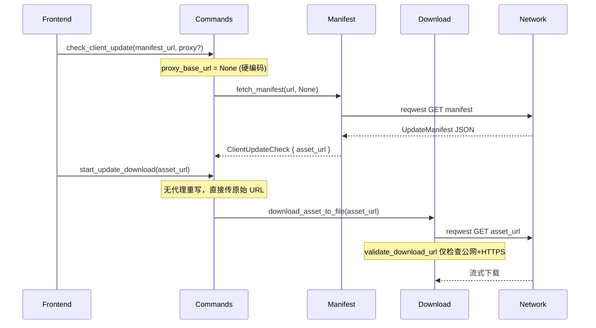
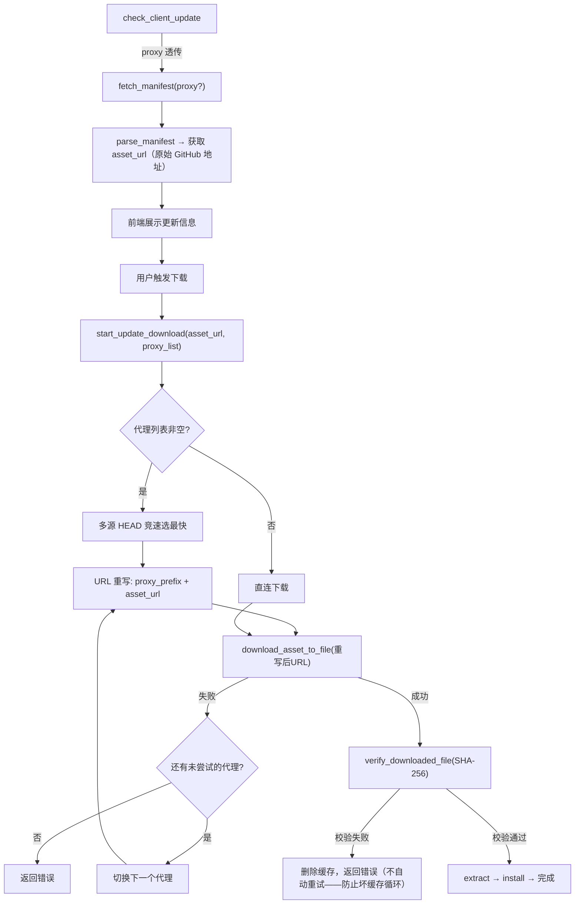

# DDNet Manager 下载链路与 GFW 绕过——方案验证 & 同类项目调研

## 速答

### 三方案验证结论

| 方案 | 正确性 | 适合本项目 | 结论 |
|------|--------|-----------|------|
| ① 公共代理 URL 重写 + 多路竞速 | ✅ 核心正确 | ✅ 最适合 | **立即落地**，改动量约 150 行 Rust + 前端配置 UI |
| ② Cloudflare Workers 自部署 | ✅ 原理正确（CPU 限制实为 10ms 非 50ms） | ✅ 适合做兜底 | **自主可控兜底**，一次性部署后零运维 |
| ③ TLS 客户端分片 | ✅ 原理正确 | ❌ 不适合 | **排除**——需系统级驱动、管理员权限、与 reqwest/Tauri 架构冲突 |

### 同类项目核心教训

- **不要维护静态代理列表**：FastGithub 1.0→1.6.3 每个版本都在"移除失效站点→新增站点"，几周就有一个站点挂掉
- **不要依赖单个公共服务**：gh-proxy 公开 demo 明确标注"不堪重负"
- **纯转发比内容修改更可持续**：jsproxy 的核心设计取舍——nginx 只改 HTTP 头，不解压/分析/替换内容
- **测速应该下载真实文件而非 ping**：chsrc 用 100MB~4.8GB 真实文件测速，ping 延迟与下载吞吐量不线性相关

## 关键证据（代码层）

### 证据 1：当前架构缺口

`src-tauri/src/commands.rs:214-219` — `check_client_update` 硬编码 `proxy_base_url = None`，manifest 代理能力已实现但未接入。

`src-tauri/src/commands.rs:265-270` — `start_update_download` 直接使用原始 `asset_url`，无代理重写。

`src-tauri/src/manifest.rs:7-13` — `TRUSTED_MANIFEST_HOSTS` / `TRUSTED_ASSET_HOSTS` 硬编码白名单会拒绝任何代理域名。

`src-tauri/src/download.rs:349-367` — 但 `validate_download_url` 仅检查 HTTPS+公网，不做白名单校验——运行时 URL 重写不会被下载层拦截。

### 证据 2：下载架构流程图



## 同类项目对比分析

### A. 下载器/包管理器类

#### rustup（Rust 工具链安装器）— ⭐ 最值得借鉴

| 维度 | 实现 | 评价 |
|------|------|------|
| **镜像切换** | 简单字符串替换 `url.replace(DEFAULT_DIST_SERVER, mirror_url)` | 极简，无额外依赖 |
| **断点续传** | 下载到 `.partial` 文件，完成后 rename 为最终文件 | 优雅，失败自动清理 |
| **校验跳过** | `update_hash` 前 20 字符快速比较，匹配则跳过下载 | 减少不必要的网络请求 |
| **错误分类** | 区分 `IncompletePartialFile`（网络中断）和 `BrokenPartialFile`（数据损坏） | 对用户友好，重试策略可差异化 |
| **镜像提示** | 校验失败时根据是否使用镜像给出不同错误提示 | 帮助用户排查是官方源问题还是镜像问题 |
| **不足** | 无多源竞速，单源失败即报错 | DDNet Manager 需要补充这点 |

**关键代码模式**（伪代码还原）：
```rust
// 镜像 URL 通过字符串替换实现，零配置侵入
let mirror_url = primary_url.replace(DEFAULT_SERVER, &user_mirror);

// 下载先写 .partial，完成再 rename
let partial = format!("{hash}.partial");
download_to(&partial)?;
verify_checksum(&partial)?;
std::fs::rename(&partial, &final_path)?;
```

#### chsrc（全平台换源工具）— ⭐ 测速策略最佳实践

| 维度 | 实现 | 评价 |
|------|------|------|
| **测速方式** | 下载真实文件（100MB~4.8GB），非 ping | 准确反映实际下载体验 |
| **多策略选择** | 自动测速 / 团队维护排名 / 用户指定 / 自定义 URL / 重置默认 | 覆盖从零配置到专家模式全场景 |
| **镜像元数据** | 每个镜像标注风险（"封杀策略过严，谨慎使用"）、兼容性问题 | 工程化的镜像管理 |
| **淘汰机制** | 速度持续过低标记"不建议再使用"（如 2025-06-20 标注 Netease/Sohu） | 数据驱动的维护决策 |
| **MVC 框架** | 每个目标（pip/npm/ubuntu...）有独立 recipe 定义可用镜像 | 可扩展，但不适合 DDNet Manager 的规模 |

**关键启示**：测速不要用 ping，要下载一个真实文件（哪怕只是 manifest JSON）来测量实际吞吐。ping 延迟和下载速度在中国网络环境下经常不线性相关——有些节点 ping 低但被 QoS 限速。

#### Motrix（aria2 前端）

| 维度 | 实现 |
|------|------|
| 下载引擎 | 完全依赖 aria2，不自己实现下载逻辑 |
| 代理 | 通过 aria2 的 `all-proxy` / `http-proxy` 配置 |
| 多线程 | aria2 原生 `--split=64` 分片并发 |
| 启示 | **不自己造轮子**——但 DDNet Manager 的场景不同（需集成校验/解压/安装/回滚），不适合直接内嵌 aria2 |

### B. GitHub 代理/镜像工具类

#### FastGithub（油猴脚本版，RC1844）— ⚠️ 反面教材

| 维度 | 发现 |
|------|------|
| **版本历史** | v1.0→v1.6.3，几乎每个版本都是"修复失效站点""移除站点""新增站点" |
| **站点存活** | 几周内就有站点需要处置。`bugkiller.org`（日本）、`laiczhang.com`（美国）已失效 |
| **GitHub 前端变更** | v1.5.7 专门修复"GitHub 网页变更产生的 bug"——注入逻辑依赖页面结构 |
| **开发者自述** | "自己并非 js 出身"——维护成本高到超出个人开发者承受范围 |
| **安全警告** | 反复强调"不要登录账号"——第三方代理可以劫持凭证 |
| **教训** | **不要把代理 URL 硬编码在代码里，用外部可更新配置** |

#### jsproxy（EtherDream）— ⭐ 架构取舍值得学习

| 维度 | 发现 |
|------|------|
| **核心取舍** | nginx 纯转发，**不修改响应内容**（只改 HTTP 头） |
| **原因** | 内容解压/分析/替换消耗 CPU，对廉价 VPS 不现实 |
| **客户端处理** | Service Worker 拦截请求 + 注入脚本劫持 DOM API |
| **前端托管** | 前端（www 目录）可部署在 GitHub Pages，减少后端流量 |
| **教训** | **纯 URL 重写（不改内容）是最可持续的方案**——正好是 DDNet Manager 方案一的核心思路 |
| **额外防御** | SSRF 防护（`setup-ipset.sh`）、IP 黑名单——代理服务会面临恶意扫描 |

#### gh-proxy（hunshcn）— 最成熟的 CF Workers 方案

| 维度 | 发现 |
|------|------|
| **代码状态** | 76 commits，最后一次更新 2020.04.10，MIT 许可 |
| **公开服务** | `gh.api.99988866.xyz` 明确标注"有点不堪重负" |
| **推荐方式** | 自部署（CF Workers 或 Python+Docker） |
| **CF Workers 限制** | 免费：10 万请求/天、CPU 10ms/请求、流式传输不占 CPU 时间、无带宽上限 |
| **Python 版** | Docker 一行部署，支持文件大小限制、user/repo 黑白名单 |

#### GitHub520（修改 hosts）— 最轻量方案

| 维度 | 发现 |
|------|------|
| **原理** | 维护一个 hosts 文件，所有 GitHub 域名 → 同一加速 IP `152.32.215.247` |
| **数据源** | `https://raw.hellogithub.com/hosts`（不依赖 GitHub 可访问） |
| **覆盖域名** | 40 条记录，含 `codeload.github.com`、S3 assets 域名等 |
| **启示** | **不要帮用户改 hosts**——CLAUDE.md 明确约束"不默认修改系统 hosts"。但可以参考其数据源思路：把代理配置放在一个非 GitHub 托管的 URL 上 |

### C. TLS/DPI 绕过工具类

#### GoodbyeDPI（ValdikSS）— 方案三的技术验证

| 维度 | 发现 |
|------|------|
| **语言** | C（99.1%），依赖 WinDivert 驱动 |
| **权限** | 需要管理员权限 |
| **分片策略** | 7 种不同方法：TCP 首包分片、HTTP keep-alive 分片、Host 大小写混淆、空格注入、伪造包等 |
| **`--frag-by-sni`** | 精准在 SNI 字段前拆分 TLS ClientHello |
| **`--reverse-frag`** | 逆序发送分片以绕过某些网站的 TCP 重组 |
| **预置模式** | 模式 1-9，用户试到哪个能用就用哪个——说明分片策略需要针对不同 ISP 适配 |
| **兼容性问题** | Intel/Qualcomm Killer 网卡冲突、ESET 反病毒冲突、旧 Win7 需额外补丁 |
| **教训** | **这是系统级工具，不应该嵌入应用层下载器**。策略需针对不同 ISP 调参，有大量兼容性问题 |

### D. Motrix Next（AnInsomniacy）— ⭐⭐⭐ 最直接参考：Tauri 2 下载管理器

**仓库**：[AnInsomniacy/motrix-next](https://github.com/AnInsomniacy/motrix-next)
**指标**：7,500+ stars，231 forks，259 releases（最新 v3.9.3，2026-06），MIT License
**技术栈**：Tauri 2 + Rust + Vue 3 Composition API + Naive UI + Vite

这是目前 GitHub 上**star 最高的 Tauri 下载管理器**，从 Electron 原版 Motrix 完全重写。技术栈与 DDNet Manager 高度重叠，是架构设计的最直接参考——但不是照搬，因为它用 aria2 做引擎而 DDNet Manager 用 reqwest 直连。

#### 核心架构对比

| 维度 | Motrix Next | DDNet Manager | 差别 |
|------|------------|---------------|------|
| **下载引擎** | Aria2 Next（fork）作为 Tauri sidecar | `reqwest` 流式下载 | ⚠️ 本质不同 |
| **进程管理** | `engine/` 模块管理 sidecar 生命周期 | `tokio::spawn` 异步任务 | Motrix Next 的启动/停止/重启模式可参考 |
| **RPC 层** | Rust → aria2 JSON-RPC（reqwest 连接池，`aria2/client.rs`） | Rust `commands` → `download`/`manifest` 直调 | DDNet Manager 更简单 |
| **配置存储** | `tauri_plugin_store`（JSON）+ SQLite 历史 | SQLite（ClientRegistry） | JSON store 更适合代理配置 |
| **错误处理** | `AppError` enum（9 变体）+ `thiserror` + `From` 转换 | 全用 `Result<_, String>` | ⚠️ DDNet Manager 的技术债 |
| **代理** | 系统代理**检测**（Win/Mac/Linux）→ 注入 aria2 `--all-proxy` | 待**新增** URL 重写层 | Motrix Next 的检测代码可直接参考 |
| **前端** | Pinia stores + `refresh_runtime_config` 同步 | React `useState` + `invoke` | 模式不同，核心理念相通 |

#### 五个最值得借鉴的实现

**① 系统代理检测（跨平台）** — `commands/proxy.rs`

```rust
// Windows：读注册表 Internet Settings
// macOS：SCDynamicStore → scutil --proxy fallback
// Linux：http_proxy env → gsettings → all_proxy
pub fn get_system_proxy() -> Result<Option<SystemProxyInfo>, AppError>
```

**对 DDNet Manager 的价值**：用户开了 Clash/V2Ray 等代理时，自动检测并填入下载代理配置——零手动操作。代码质量高，可以直接参考适配。处理了 Windows 的两种注册表格式（统一 `host:port` 和 `http=...;socks=...` 分协议格式）、macOS 的 CoreFoundation 字典和 `scutil` 文本解析、Linux 的 GNOME gsettings。

**② 健康检查 + 指数退避** — `commands/engine.rs:wait_for_engine`

```rust
// 最多 5 次重试，200ms 起指数退避，上限 3s
for i in 0..MAX_RETRIES {
    match probe().await {
        Ok(_) => return Ok(true),
        Err(e) => {
            let delay = min(BASE_DELAY_MS * 2u64.pow(i), 3000);
            sleep(delay).await;
        }
    }
}
```

**对 DDNet Manager 的价值**：多代理竞速失败后的重试应使用此模式——不要固定间隔，指数退避避免打爆代理服务器。注意 Motrix Next 这里的 `MAX_RETRIES=5`，DDNet Manager 的代理列表通常 3-5 个，每个代理一次尝试就够了，但 fallback 链之间可以加退避。

**③ 类型化错误系统** — `error.rs`

```rust
#[derive(Debug, Serialize, thiserror::Error)]
pub enum AppError {
    #[error("Store error: {0}")]  Store(String),
    #[error("Engine error: {0}")] Engine(String),
    #[error("IO error: {0}")]     Io(String),
    #[error("Aria2 RPC error: {0}")] Aria2(String),
    #[error("Database error: {0}")] Database(String),
    // 9 variants total，每个带 From 自动转换
}
impl From<std::io::Error> for AppError { ... }
impl From<reqwest::Error> for AppError { ... }
```

**对 DDNet Manager 的价值**：当前所有函数返回 `Result<_, String>` 是明显的技术债。应引入 `thiserror`，至少定义 `Network`、`Manifest`、`Download`、`Verify`、`Extract`、`Install`、`Registry`。`From` 自动转换让 `?` 操作符无痛使用类型化错误，且序列化后的错误前端可以区分处理（网络错误提示重试 vs 校验错误提示检查 manifest）。

**④ Config Store + Rust 侧状态同步** — `commands/runtime_config.rs`

```rust
#[tauri::command]
pub async fn refresh_runtime_config(app: AppHandle) -> Result<(), AppError> {
    let store = app.store("config.json")?;
    let prefs = store.get("preferences").ok_or(...)?;
    app.state::<RuntimeConfigState>().refresh_from_json(&prefs).await?;
}
```

**对 DDNet Manager 的价值**：代理列表、首选代理、自动/手动模式等配置用 `tauri_plugin_store` 管理的 JSON 文件存储（比 SQLite 更适合纯键值配置），前端通过 `invoke("refresh_runtime_config")` 保持 Rust 侧状态同步。

**⑤ 编排模式** — `services/mod.rs:on_engine_ready`

```
步骤 1：更新凭据
步骤 2：刷新运行时配置
步骤 3：读取系统选项
步骤 4：应用覆盖规则
步骤 5：推送到引擎
步骤 6：启动后台服务
```

**对 DDNet Manager 的价值**：下载前的准备链（检测系统代理 → 合并用户配置 → 竞速选代理 → 重写 URL → 开始下载）也应该用清晰的状态机编排，而不是散落在命令函数里。

#### 哪些不抄

| Motrix Next 功能 | 不抄的原因 |
|-----------------|-----------|
| aria2 sidecar（~15MB 额外体积） | DDNet Manager 只下载 zip release，不需要 BT/ED2K/多线程分片 |
| 26 语言国际化 | 中文用户为主，过度工程 |
| 10 套配色方案 | 工业霓虹一套风格已确定 |
| 浏览器扩展集成 | 无关场景 |
| UPnP 端口映射 | 不监听入站端口 |
| BT/DHT/ED2K 协议 | 纯 HTTP(S) 下载 |
| Sidecar 进程管理 | 无外部进程需要管理 |

#### SpoofDPI（xvzc）

| 维度 | 发现 |
|------|------|
| **语言** | 实际是 Go（非 Rust，README 中的"Rust"标签有误导） |
| **现状** | 文档链接指向独立站点 `spoofdpi.dev`，项目活跃度不明 |

## 值得借鉴的核心模式

### ✅ 模式 1：镜像 URL 运行时重写（rustup 风格）

```rust
// 不在 manifest 数据层改 URL，在下载执行层重写
fn resolve_asset_url(original: &str, proxy: Option<&str>) -> String {
    match proxy {
        Some(prefix) => format!("{}{}", prefix.trim_end_matches('/'), original),
        None => original.to_string(),
    }
}
```

**为什么好**：manifest 里的 `asset_url` 始终是原始 GitHub 地址（权威源），proxy 层是运行时可配置的策略，两者解耦。

### ✅ 模式 2：断点续传（rustup .partial 模式）

```rust
// download.rs 已有的代码接近此模式，但缺少 resume 逻辑
let partial_path = format!("{}.partial", cache_path);
// 后面可增加：检查 partial 是否存在 → HEAD 请求确认 Range 支持 → 续传
```

DDNet Manager 的 `download_asset_to_file` 当前不支持 resume，但架构已经支持（流式下载 + 进度回调 + 取消）。

### ✅ 模式 3：多源竞速（chsrc 风格，适配后）

```rust
// 不是 ping，是下载一个小文件（manifest）来测速
async fn race_mirrors(mirrors: &[MirrorConfig]) -> Option<MirrorConfig> {
    let tasks: Vec<_> = mirrors.iter().map(|m| {
        let url = format!("{}/manifest.json", m.base_url);
        async move {
            let start = Instant::now();
            let result = reqwest::get(&url).await;
            let elapsed = start.elapsed();
            result.ok().map(|_| (m.clone(), elapsed))
        }
    }).collect();
    // 第一个成功的即为最快
    futures::future::select_ok(tasks).await.ok().map(|(r, _)| r.0)
}
```

### ✅ 模式 4：可更新的代理配置（GitHub520 风格）

代理列表不应该硬编码在二进制里，应该从一个**不依赖 GitHub 的 URL** 拉取更新：

```
https://raw.hellogithub.com/hosts        ← 托管在非 GitHub 的 CDN 上
<项目自维护代理配置地址>                 ← 由项目配置显式指定，当前不绑定具体线上域名
```

### ✅ 模式 5：分层降级（业界最佳实践汇总）

```
Level 1: DNS over HTTPS 解析 + 直连 GitHub 官方 IP（零中转，速度最快）
    ↓ 失败（TCP 超时 / TLS 握手失败 / HTTP 错误）
Level 2: 公共代理列表竞速（选最快的活着的那一个）
    ↓ 全部失败
Level 3: 自部署 Cloudflare Workers / 项目自维护镜像
    ↓ 仍失败
Level 4: 告知用户手动配置代理 或 提供离线安装包
```

## 应避免的坑

### ❌ 坑 1：硬编码代理列表

**FastGithub 的教训**：1.6 个大版本几乎全部在"移除失效站点→添加新站点"的循环里。代理 URL 必须外部化、可热更新。

```rust
// ❌ 不要这样
const PROXY_URLS: &[&str] = &["https://ghproxy.com/", "https://ghfast.top/"];

// ✅ 应该这样
// 从项目自维护 manifest/config 读取，或从本地配置文件读取
```

### ❌ 坑 2：用 ping 测速

**chsrc 的教训**：下载一个真实文件（哪怕是 1KB manifest）来测量。中国 ISP 的 QoS 策略经常对 ICMP 和 HTTP 流量区别对待——ping 通不代表下载快。

### ❌ 坑 3：在 manifest 数据层重写 URL

**jsproxy 的教训**：纯转发，不改内容。URL 重写应该在代码执行层做，manifest JSON 始终保存原始 GitHub 地址，保持数据完整性。

```json
// ✅ manifest 中的 asset_url 不变
{ "asset_url": "https://github.com/ddnet/ddnet/releases/download/v1/qmclient.zip" }

// 运行时：format!("{proxy_prefix}{asset_url}")
```

### ❌ 坑 4：忽略代理的安全风险

**FastGithub 的警告**："不要在镜像网站登录账号"。但 DDNet Manager 的下载是公开的 Release 资产，不涉及凭证——只要 SHA-256 校验通过就是安全的。**SHA-256 校验是最后一道防线，无论走什么代理下载，最终校验保证了数据完整性**。

### ❌ 坑 5：在应用层实现 TLS 分片

**GoodbyeDPI 的教训**：需要 WinDivert 内核驱动、多种分片策略适配不同 ISP、大量兼容性问题（网卡驱动冲突、反病毒冲突）。这是系统级工具，不是应用层该做的事。

### ❌ 坑 6：不区分网络故障类型

**rustup 的做法值得借鉴**：区分 `IncompletePartialFile`（网络中断，可重试）和 `BrokenPartialFile`（数据损坏，需重新下载）。对不同错误类型做不同处理，避免无意义的重试消耗。

### ❌ 坑 7：忽略下载后的校验流程

当前 `download.rs` 的校验设计是正确的——但必须确保代理下载完成后 **SHA-256 校验是强制的**。走代理下载的风险不是中间人攻击（有 HTTPS），而是代理可能缓存旧版本或传输损坏。SHA-256 校验就是最后的保障。

## 对 DDNet Manager 的最佳架构建议



### 具体改动清单

| 优先级 | 改动 | 文件 | 规模 |
|--------|------|------|------|
| P0 | `check_client_update` 透传 `proxy_base_url` | `commands.rs:219` | 1 行 |
| P0 | `start_update_download` 增加 `proxy_base_url` 参数 + URL 重写 | `commands.rs:247`, `models.rs:160` | ~30 行 |
| P0 | 代理域名加入 allowlist（或 allowlist 改为可配置） | `manifest.rs:7-13` | ~20 行 |
| P1 | 多代理 HEAD 竞速选择 | 新增 `mirror.rs` | ~50 行 |
| P1 | 前端代理配置 UI + 自动/手动模式 | 前端组件 | ~80 行 |
| P1 | 缺少 `proxy_base_url` 支持的前端 IPC 封装 | `src/lib/tauri.ts` | ~5 行 |
| P2 | .partial 断点续传 | `download.rs:100-155` | ~60 行 |
| P3 | Cloudflare Workers 自部署（可选兜底） | 外部 | 一次性 |
| — | **Motrix Next 启发的新增项** | | |
| A1 | 引入 `thiserror` + `AppError` enum 替代 `Result<_, String>` | 新增 `error.rs` | ~100 行（含 `From` 转换） |
| A2 | 系统代理自动检测（Windows 注册表优先） | 新增 `proxy_detect.rs` | ~80 行 |
| A3 | `tauri_plugin_store` 管理代理配置 + `refresh` 命令 | 新增 store，修改 `commands.rs` | ~50 行 |
| A4 | 代理竞速失败后的指数退避重试 | `download.rs` 或新 `mirror.rs` | ~30 行 |
