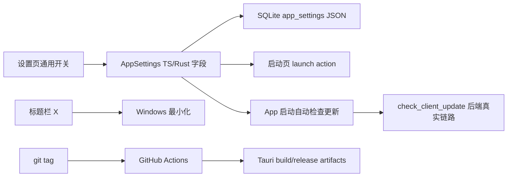

## 速答

这次要做的不是补两个开关外观，而是补一条完整行为链：`AppSettings` 持久化字段、设置页可交互控件、启动后动作、应用启动时自动检查默认客户端更新、标题栏关闭按钮最小化，以及 GitHub Actions/tag/release 发布配置。

当前代码里设置持久化已经可用，但“启动后关闭面板”和“自动检查更新”只是 UI 文案：前端类型和 Rust 模型没有字段，`TogglePill` 在通用页没有点击处理，也没有任何 effect 根据设置自动触发更新检查。客户端更新检查本身已经有真实后端链路，普通流程会按 catalog 分派到 GitHub Release、DDNet 官网或网站来源；缺口在“何时自动触发”和“如何在 UI 中呈现结果”。Manager 自身的 CI / release / tags 链路目前不存在：仓库没有 `.github` 目录，也没有 Tauri updater 插件或 GitHub Action 配置。

## 关键证据

| # | 结论 | 证据 | 位置 |
|---|------|------|------|
| 1 | 设置持久化已有后端入口，可扩展字段 | `load_app_settings` / `save_app_settings` 通过 Tauri command 读写 `AppSettings`。 | `src-tauri/src/commands.rs:160` |
| 2 | 设置以 JSON blob 存在 SQLite，不需要为两个布尔字段做表结构迁移 | `app_settings` 表只有 `key` 和 `value` 两列。 | `src-tauri/src/registry.rs:369` |
| 3 | 当前 Rust 设置模型没有启动行为或自动检查更新字段 | `AppSettings` 只有 `network_route`、`scan_excluded_paths`、`use_everything`、`github_token`、`advanced_manifest_url`。 | `src-tauri/src/models.rs:219` |
| 4 | 当前 TS 设置模型同样没有对应字段 | `AppSettings` 类型只声明网络、扫描、Everything、GitHub token、manifest URL。 | `src/types.ts:75` |
| 5 | 截图里的两个开关目前是 UI 壳子 | 通用页直接渲染 `<TogglePill checked label="启动后关闭面板" />` 和 `<TogglePill checked={false} label="自动检查更新" />`，没有 `onClick` 或 `onSettingsChange`。 | `src/components/settings/SettingsDialog.tsx:200` |
| 6 | 已有其他设置证明同一面板可以做真实写入 | Everything 开关包了一层 `button`，点击后调用 `onSettingsChange({ ...props.settings, use_everything: !props.settings.use_everything })`。 | `src/components/settings/SettingsDialog.tsx:322` |
| 7 | 手动检查更新已有真实链路，可被自动检查复用 | `UpdatePanel` 调用 `checkClientUpdate`，传入默认客户端、channel、manifest/network route 设置。 | `src/components/update/UpdatePanel.tsx:206` |
| 8 | 后端普通更新检查已经分派到 catalog 更新源，不是 mock | `check_client_update` 在非 manifest 模式下按 `client_catalog` 查 entry，并调用 `check_catalog_update`。 | `src-tauri/src/update_source.rs:28` |
| 9 | GitHub Release 适配器已经读取 latest release 和 asset digest | `check_latest_release` 请求 `https://api.github.com/repos/{owner}/{repo}/releases/latest` 并解析 release。 | `src-tauri/src/github_release.rs:48` |
| 10 | 标题栏关闭按钮现在是真的关闭窗口 | `close()` 调用 `appWindow.close()`。 | `src/components/layout/TitleBar.tsx:15` |
| 11 | Tauri 配置允许 close 和 minimize，但没有拦截窗口关闭事件 | capabilities 同时允许 `core:window:allow-close` 和 `core:window:allow-minimize`；`main.rs` setup 只设置阴影，没有 `WindowEvent::CloseRequested` 处理。 | `src-tauri/tauri.conf.json:48` |
| 12 | 仓库没有 GitHub Actions / release 自动化配置 | 根目录检查返回 `NO_GITHUB_DIR`；现有 `Makefile` 只有本地 install/dev/check/build/tauri-build 等目标。 | `Makefile:1` |

## 探索范围

- 聚焦目录：`src/`、`src-tauri/src/`、`src-tauri/tauri.conf.json`、`Makefile`、`.github`。
- 涉及文件：`src/App.tsx`、`src/types.ts`、`src/lib/tauri.ts`、`src/components/settings/SettingsDialog.tsx`、`src/components/update/UpdatePanel.tsx`、`src/components/layout/TitleBar.tsx`、`src-tauri/src/models.rs`、`src-tauri/src/commands.rs`、`src-tauri/src/registry.rs`、`src-tauri/src/update_source.rs`、`src-tauri/src/github_release.rs`、`src-tauri/src/main.rs`、`src-tauri/tauri.conf.json`、`Makefile`。
- 跳过：未实际联网验证 GitHub Release API；本次目标是仓库现状探索，不是确认上游最新 release 可达性。未运行构建或测试，因为未改实现代码。

## 置信度说明

**confidence: high**

已覆盖前端设置渲染、集中 IPC 封装、Rust 设置模型、SQLite 存储、更新检查后端、标题栏窗口控制、Tauri 权限配置和仓库级 CI 配置。唯一没有覆盖的是真实发布凭据、仓库远端权限和 GitHub Actions secrets，因为这些不在本地代码里。

## 后续建议

可以基于这份探索进入设计/实施：优先把两个开关做成真实 `AppSettings` 字段并接入行为，再补 GitHub Actions 的 tag release 构建链路。
