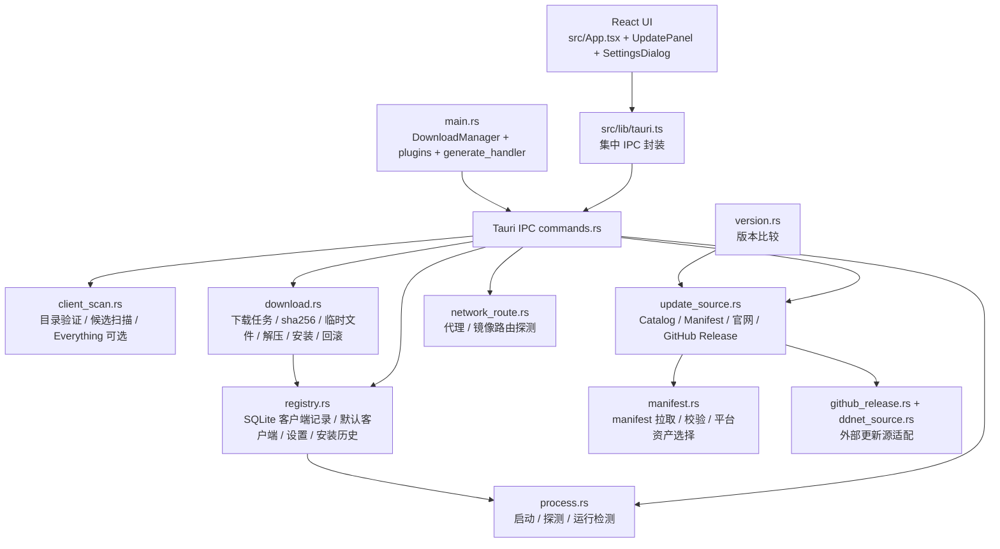

## 速答

当前后端已经不是 2026-06-06 探索中记录的 mock/stub 状态：`src-tauri` 已拆出客户端识别、catalog、SQLite 注册表、更新源分派、manifest、真实下载、安装事务、进程检测、网络路由和版本比较等模块，并在 `main.rs` 注册了 19 个 Tauri IPC 命令。核心闭环已经覆盖“扫描/验证客户端 → 保存默认客户端 → 检查更新 → 创建下载任务 → 下载并校验 → 解压/安装/回滚记录 → 启动/运行检测”。

前端也已经开始消费这批真实能力：`src/lib/tauri.ts` 对 19 个 IPC 形成集中封装，启动页通过默认客户端与运行检测构造 readiness，设置页保存后端设置，更新页可以检查更新、启动真实下载、监听下载进度并触发安装。下一阶段的方向不是“从零实现后端”，而是把已有后端产品化：下载任务持久化/恢复、安装事件完整 UI、安装历史展示、真实 Tauri 端到端验证、错误类型产品化，以及跨平台安装事务/启动诊断。

README 对“已有基础、仍需打磨”的描述基本吻合当前代码；但 `CLAUDE.md` 中旧的“当前已有命令仍是首版 mock / stub”表格曾经过期，当前工作区内的 `CLAUDE.md` 已更新为新的命令分组描述。当前主要边界是：下载任务状态仍是进程内内存态，自动扫描和设置体验仍处于 MVP 打磨阶段，安装事务已有回滚目录与历史记录但还未经过真实 QmClient 包端到端运行验证。

## 关键证据

| # | 结论 | 证据 | 位置 |
|---|------|------|------|
| 1 | 当前后端已有 19 个真实 IPC 命令，并由 Tauri builder 注入进程内下载管理器 | `main.rs` 先 `.manage(download::DownloadManager::default())`，再注册 `validate_client_dir` 到 `install_downloaded_update` 共 19 个 command | `src-tauri/src/main.rs:44-76` |
| 2 | 客户端管理能力已落地到扫描验证 + SQLite 注册表 + 默认客户端 | command 层扫描时读取设置并合并保存路径；upsert 会重新验证目录；注册表负责 list/default/settings/history | `src-tauri/src/commands.rs:51-86`, `src-tauri/src/commands.rs:88-121`, `src-tauri/src/registry.rs:159-225` |
| 3 | 启动链路不是简单 spawn：默认客户端启动前会复检健康、兼容性，并记录启动探测结果 | `launch_default_client` 从注册表取默认客户端，重新 `validate_client_dir`，检查 `ClientHealth::Ok` 与 `can_launch`，再 `launch_executable_with_probe` 并写回 probe 结果 | `src-tauri/src/commands.rs:130-157` |
| 4 | 更新源已经可在 manifest 与内置 catalog 之间分派，下载入口会二次检查更新并路由资产 URL | `check_client_update` 在 manifest 模式要求显式 URL；`prepare_update_download_job` 从注册表找目标客户端、调用 `update_source::check_client_update`、拒绝非下载动作，并用网络路由构造 asset URL | `src-tauri/src/commands.rs:197-217`, `src-tauri/src/commands.rs:241-288` |
| 5 | 下载任务是真实异步下载 + 校验 + 事件流，但状态仍只在当前进程内存中 | `DownloadManager` 是 `Arc<Mutex<HashMap<String, DownloadJob>>>`；下载任务 `tokio::spawn` 后发 `download-progress`、校验成功发 `download-completed`，失败清缓存并发 `download-failed` | `src-tauri/src/download.rs:48-96`, `src-tauri/src/commands.rs:303-365` |
| 6 | 安装事务已具备健康检查、运行中拦截、staging、回滚和安装历史记录 | `install_downloaded_update` 仅接受 `Verified` job；安装前验证目标客户端并拒绝运行中；事务中解包 staging、查 staged client、替换目录、记录成功/失败历史、发安装事件 | `src-tauri/src/commands.rs:385-420`, `src-tauri/src/commands.rs:443-615` |
| 7 | 前端 IPC 封装已基本覆盖后端注册面，并构造了启动 readiness | `src/lib/tauri.ts` 封装客户端、设置、manifest、更新、下载、安装、启动、运行检测；`getLaunchReadiness` 组合默认客户端、健康、兼容性和 `isClientRunning` | `src/lib/tauri.ts:17-45`, `src/lib/tauri.ts:45-95`, `src/lib/tauri.ts:97-146` |
| 8 | 前端更新页已接入真实检查/下载/安装，但安装事件与历史展示仍未产品化 | `UpdatePanel` 读取默认客户端和设置，监听 `download-progress/completed/failed`，调用 `checkClientUpdate`、`startUpdateDownload`、`installDownloadedUpdate`；但 `listInstallHistory` 在前端只有封装，没有 UI 使用 | `src/components/update/UpdatePanel.tsx:117-178`, `src/components/update/UpdatePanel.tsx:206-296`, `src/components/update/UpdatePanel.tsx:469-488`, `src/lib/tauri.ts:105-107` |

## 详细观察

### 当前后端能力清单

1. **客户端发现与识别**
   - `validate_client_dir` 校验用户选择目录，返回 `ClientInstallation`。
   - `scan_client_installations` 支持根目录扫描、保存路径纳入扫描、深度扫描以及 Everything 可选加速。
   - `client_catalog.rs` 已内置多客户端 catalog，不再只硬编码 QmClient；模型可表达 DDNet、QmClient Nightly 与第三方兼容客户端。

2. **客户端注册表与设置持久化**
   - `registry.rs` 使用 SQLite 保存客户端安装记录。
   - 支持 upsert、list、remove、set/get default。
   - 同一时间只允许一个默认客户端。
   - 同一注册表还保存 `AppSettings` 和安装历史。

3. **启动与运行检测**
   - `launch_client` 可按路径启动。
   - `launch_default_client` 会重新验证默认客户端目录健康与兼容性，再启动并写回启动探测结果。
   - `is_client_running` 可判断指定可执行文件是否正在运行。

4. **更新源与 manifest**
   - `load_manifest` 支持带网络路由的 manifest 拉取。
   - `check_client_update` 可走内置 catalog 更新源，也可在 `use_manifest_source` 时要求显式 manifest URL。
   - `update_source.rs` 能分派 GitHub Release、DDNet 官方下载页、普通官网手动下载和 manifest 来源。

5. **下载与安装事务**
   - `start_update_download` 创建下载任务并异步下载真实资产。
   - 下载过程通过 `download-progress` 事件推送进度。
   - 下载后执行 size + sha256 校验。
   - `install_downloaded_update` 对已验证任务执行 staging 解包、安装替换、回滚目录、成功/失败历史记录和事件通知。
   - `cancel_download` 与 `get_download_job` 提供任务控制和查询。

6. **网络路由与 GFW 相关基础**
   - `network_route.rs` 与 `NetworkRouteConfig` 表达直连、代理前缀、镜像模板等策略。
   - 下载请求中显式携带 `enabled_route_hosts`，降低非授权 host 被滥用的风险。

### 前端集成现状

1. **集中 IPC 封装已到位**
   - `src/lib/tauri.ts` 已把客户端、设置、更新、下载、安装和启动命令集中起来，符合项目“组件不散落裸 invoke”的规则。
   - `src/types.ts` 与 Rust 模型大体同步，覆盖 `ClientInstallation`、`AppSettings`、`ClientUpdateCheck`、`DownloadJob`、`InstallHistoryRecord`。

2. **启动页已经使用后端默认客户端与运行检测**
   - 应用加载时调用 `getLaunchReadiness`，它组合 `getDefaultClient` 与 `isClientRunning`。
   - 主按钮会在未配置时引导定位/验证，在已就绪时调用 `launchDefaultClient`，启动后刷新 readiness，并按设置决定是否最小化窗口。

3. **设置页已能影响后端行为**
   - `loadAppSettings` 初始化本地状态，`saveAppSettings` 将设置持久化到 SQLite。
   - 设置项包括 `use_everything`、扫描排除路径、网络路由、GitHub token、manifest URL、自动检查更新、启动后关闭面板。
   - 这些设置已被扫描和更新链路读取，不只是 UI 本地状态。

4. **更新页已能驱动真实下载/安装，但还缺完整体验闭环**
   - 页面能读取默认客户端和设置，检查更新，启动下载，显示下载进度，校验完成后触发安装。
   - 当前只监听下载相关事件；后端已经发 `install-progress` / `install-completed` / `install-failed`，但前端更新页还没有监听这些安装事件。
   - `listInstallHistory` 已封装但没有 UI 使用，因此“成功/失败安装历史”还没有反馈给用户。

### IPC 命令分组

| 分组 | 命令 |
|---|---|
| 客户端目录与注册表 | `validate_client_dir`, `scan_client_installations`, `upsert_client_installation`, `remove_client_installation`, `set_default_client`, `list_client_installations`, `get_default_client` |
| 启动与运行检测 | `launch_client`, `launch_default_client`, `is_client_running` |
| 设置与历史 | `load_app_settings`, `save_app_settings`, `list_install_history` |
| 更新与 manifest | `load_manifest`, `check_client_update` |
| 下载与安装 | `start_update_download`, `cancel_download`, `get_download_job`, `install_downloaded_update` |

### 后续成熟化方向（由现有缺口推导）

1. **下载任务持久化与恢复**
   - 证据：`DownloadManager` 明确是进程内 `HashMap`。
   - 含义：应用重启后无法恢复下载任务状态；缓存中已下载但未安装的资产也缺少“继续安装/清理”的产品入口。

2. **安装事件与历史 UI**
   - 证据：后端发 `install-progress`、`install-completed`、`install-failed`，前端更新页只监听下载事件；`listInstallHistory` 只有封装无 UI 使用。
   - 含义：安装阶段用户反馈不完整，失败恢复/回滚目录也难以被用户理解。

3. **真实端到端验证**
   - 证据：当前测试主要覆盖模块级逻辑和文件事务；探索未看到 GUI 触发真实下载/安装/启动的端到端验收。
   - 含义：安装事务虽然代码上考虑 staging/rollback，但真实 QmClient 包结构、Windows 文件锁、权限、杀软干扰等仍需实际验证。

4. **错误类型产品化**
   - 证据：后端 command 多数返回 `Result<_, String>`；前端 `UpdatePanel` 通过字符串包含关系把错误转成用户文案。
   - 含义：短期可用，但后续如果要稳定本地化、分级重试、诊断建议，应把错误码/错误分类纳入 IPC 契约。

5. **跨平台安装与启动诊断**
   - 证据：自动安装 guard 当前只保守支持 zip，`tar.xz` / `dmg` 等包类型走手动或禁止自动安装；启动/运行检测目前以 Windows 优先为核心。
   - 含义：Windows MVP 可以继续推进，但跨平台成熟化需要单独设计包类型、权限、文件替换和进程检测策略。

6. **客户端管理体验整合**
   - 证据：后端已有扫描、保存、默认客户端；前端已有 `ClientManager` 与 `GamesPanel`，但启动页主要围绕单个默认客户端 readiness。
   - 含义：后续可把扫描结果、默认切换、健康修复建议、更新状态聚合到更明确的“客户端管理”流程里。

### 与 README / CLAUDE 的差距

- **README：基本同步。** README 的“已有基础、仍需打磨”表述与当前代码状态一致，尤其是客户端注册表、真实下载任务和安装事务这几项。
- **CLAUDE：当前工作区已同步到较新描述。** 旧文档曾称 `check_update` mock、`start_download` 模拟、`launch_game` 存根；当前工作区 `CLAUDE.md` 已改成按能力分组列出 19 个真实 IPC，并说明“不再是首版 mock / stub”。
- **非目标约束基本被遵守。** 当前模块列表没有恢复 Binds、Workshop 或资源管理模块；旧的 `cfg.rs`、`workshop.rs`、`file_tx.rs` 在当前工作树中已删除。

### 测试覆盖概况

当前 `src-tauri/src/test/` 下已有多模块测试：

- `client_scan.rs`：客户端识别、路径扫描、排除路径、客户端类型与健康状态。
- `registry.rs`：upsert/list/default/remove、历史记录、设置、旧记录归一化。
- `manifest.rs`：manifest JSON 校验、URL/host 安全、路由构造、资产选择。
- `download.rs`：sha256、文件校验、下载 URL 规则、包类型、解压、安装/回滚，以及少量 tokio 下载测试。
- `process.rs`：进程名识别、启动目标解析、运行检测基础。
- `commands.rs`：manifest URL 必填规则。
- `github_release.rs` / `ddnet_source.rs` / `network_route.rs` / `update_source.rs` / `version.rs` / `models.rs`：外部更新源、网络路由、版本比较和序列化基础。

测试强项是 **纯逻辑和文件系统事务单元测试**；薄弱点是 **Tauri AppHandle、事件发射、真实 IPC、真实 GUI 触发下载/安装/启动的端到端验证**。

## 探索范围

- 聚焦目录：`src-tauri/src/`、`src-tauri/src/test/`
- 前端核对：`src/lib/tauri.ts`、`src/types.ts`、`src/App.tsx`、`src/components/update/UpdatePanel.tsx`、`src/components/settings/SettingsDialog.tsx`
- 文档核对：`README.md`、`CLAUDE.md`
- 已读关键文件/符号：`main.rs`、`commands.rs`、`models.rs`、`registry.rs`、`client_scan.rs`、`download.rs`、`update_source.rs`、`src/lib/tauri.ts`、`UpdatePanel`、`App` 设置/启动/自动更新路径
- 跳过：没有运行 `make check-lint`，因为本次是只读探索与文档归档；没有实际启动 Tauri 应用、执行真实网络下载或安装真实 QmClient 包。

## 置信度说明

**confidence: high**

- 已覆盖后端注册入口、IPC command 层、核心领域模型、下载/安装主流程、注册表持久化、前端 IPC 封装、启动页和更新页消费路径。
- 关键结论均有 `file:line` 证据支持。
- 未做真实运行验证，因此关于“端到端体验是否稳定”的判断保持为边界说明，而不是能力结论。

## 未解问题

- 当前下载任务存在 `DownloadManager` 的进程内 `HashMap`，应用重启后的任务恢复策略未在本次探索中看到持久化闭环。
- 安装事务已具备 staging/rollback 基础，但尚未通过真实 QmClient 包端到端验证其用户体验和失败恢复路径。
- 后端安装事件已存在，但前端是否应在更新页、通知系统还是客户端详情页承载安装历史与失败恢复，需要后续产品/交互设计。
- 错误类型是否要从 `String` 升级为带 `code` / `message` / `recoverability` 的结构化 IPC 契约，需要结合 UI 错误展示和日志策略决定。

## 相关文档

- `2026-06-06-后端强化探索.md` — 旧状态探索，已标记 outdated，本报告替代其“当前后端能力”结论。
- `2026-06-07-下载链路与GFW绕过方案.md` — 补充下载/网络路由方向。
- `2026-06-07-GitHub更新源MVP与Gitee调查.md` — 补充 GitHub/Gitee 更新源调研。
- `2026-06-07-启动设置发布链路与窗口行为探索.md` — 补充启动设置、窗口行为和前端发布链路。

## 后续建议

如果下一步要继续推进实现，建议优先补“已有后端能力到前端体验”的闭环：监听安装事件、展示安装历史/回滚路径、补下载任务恢复策略，并用真实 Tauri 应用跑一次默认客户端启动、更新检查、下载校验和安装失败恢复验证。
