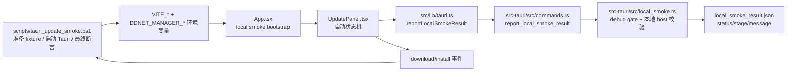

## 速答

本次 Tauri update smoke 不是“脚本直接伪造成功”，而是一条真实的本地更新闭环：`scripts/tauri_update_smoke.ps1` 负责准备 loopback fixture、注入环境变量并做最终验收；`App.tsx` 负责把桌面应用自动引导到更新页；`UpdatePanel.tsx` 负责自动推进“检查更新 → 下载 → 安装”；`src/lib/tauri.ts` 和 `src-tauri/src/commands.rs` 负责把结果写回脚本约定的 JSON 文件。

本地 smoke 的放行边界依然很硬：只有 `debug_assertions` 且显式设置 `DDNET_MANAGER_ALLOW_LOCAL_SMOKE` 时，后端才允许上报结果；URL 仍然只接受本地地址范围，同时继续拒绝歧义数字 host（如 `127.1`、`2130706433`、`0177.0.0.1`）。这意味着 smoke 是一个**仅限本地调试的自动验收通道**，不是对正式网络边界的放宽。

本次实际修复的问题也不在下载/安装逻辑本身，而在验收脚本：更新后的 `DDNet.exe` fixture 自带尾随 LF，旧断言按全文本全等比较会误报失败；当前脚本改为只 `TrimEnd` 尾随 `CR/LF`，主体内容仍然必须精确等于 `smoke-updated-build`。因此这次修复消除了 false negative，但没有降低 smoke 的验收强度。

## 关键证据

| # | 结论 | 证据 | 位置 |
|---|------|------|------|
| 1 | smoke 脚本负责准备本地 fixture、注入 local smoke 环境变量并在最后同时校验结果文件和更新后二进制 | 脚本先生成本地当前客户端目录与更新 zip，再设置 `DDNET_MANAGER_ALLOW_LOCAL_SMOKE`、`DDNET_MANAGER_LOCAL_SMOKE_RESULT_PATH`、`VITE_DDNET_MANAGER_LOCAL_SMOKE*`，最后调用 `Assert-LocalSmokeSucceeded` 与 `Assert-UpdatedClientBinary` | `scripts/tauri_update_smoke.ps1:171-198`, `scripts/tauri_update_smoke.ps1:298-320` |
| 2 | App 层的 smoke bootstrap 不绕过现有验证逻辑，而是先回填客户端目录、复用目录验证，再切到更新页 | `localSmokeBootstrapStateRef` 防止重复启动；effect 中先 `setClientPath(...)`，再 `await validateClientPath(...)`，成功后才 `setActiveView("update")` | `src/App.tsx:514`, `src/App.tsx:790-810` |
| 3 | 前端通过集中 IPC 封装上报 smoke 结果，没有在组件里散落裸 `invoke` | `reportLocalSmokeResult` 统一调用 `invoke("report_local_smoke_result", { result })` | `src/lib/tauri.ts:121-123` |
| 4 | UpdatePanel 对 smoke 结果采用“一次性上报 + 可选自动关窗”收口 | `completeSmoke` 在 `smokeReportedRef.current` 已置位时直接返回；成功调用 `reportLocalSmokeResult` 后，按 `smokeCloseWindowOnFinish` 决定是否关闭窗口 | `src/components/update/UpdatePanel.tsx:219-250` |
| 5 | UpdatePanel 的自动状态机会真实推进检查、下载、安装，并把安装成功/失败映射为 smoke 结果 | `install-completed` 时上报 `("succeeded", "install")`，`install-failed` 时上报 `("failed", "install", error)`；另一处 effect 根据 `idle / waiting_download / waiting_install` 自动调用 `check()`、`download()`、`installJob()` | `src/components/update/UpdatePanel.tsx:408-439`, `src/components/update/UpdatePanel.tsx:654-687` |
| 6 | 后端结果落盘必须同时满足“显式结果路径 + 已启用 local smoke”两个条件 | `required_local_smoke_result_path` 强制从 `DDNET_MANAGER_LOCAL_SMOKE_RESULT_PATH` 读取路径；`write_local_smoke_result_report` 先检查 `is_local_smoke_enabled()`，再序列化并写入 JSON | `src-tauri/src/commands.rs:315-345` |
| 7 | local smoke 的放行边界仍然是 debug + 显式 env + 本地地址，并继续拒绝歧义数字 host | `is_local_smoke_enabled()` 要求 `cfg!(debug_assertions)` 且 env 开启；`allows_local_smoke_url()` 还要求 host 属于本地范围；`has_ambiguous_numeric_url_host` / `is_ambiguous_numeric_host` 持续拦截纯数字/点数字写法 | `src-tauri/src/local_smoke.rs:3`, `src-tauri/src/local_smoke.rs:31-55`, `src-tauri/src/local_smoke.rs:91-100` |
| 8 | 本次修复只放宽了尾随换行噪音，不放宽更新后二进制的主体内容断言 | `Assert-UpdatedClientBinary` 先 `ReadAllText`，再仅对尾随 `CR/LF` 做 `TrimEnd`；比较目标仍然是精确字符串 `smoke-updated-build`，失败时额外输出原始字节 | `scripts/tauri_update_smoke.ps1:94-105` |

## 详细观察

### 1. 实现分层：脚本搭环境，前端推进状态，后端收口结果

这条 smoke 链路的职责边界比较清楚：

- **脚本层**只负责准备本地 fixture、分配端口、注入环境变量、启动 `bun run tauri dev`、等待并校验最终结果；
- **App 层**只负责识别 local smoke 自动化模式，并把应用引导到已经存在的“更新”主流程；
- **UpdatePanel 层**复用真实更新能力，把 smoke 变成无人值守的 UI 状态机；
- **Rust command / local_smoke 层**负责把“允许上报”与“结果落盘”收紧到 debug-only 本地验收通道。

这种分层的直接收益是：当 smoke 失败时，可以很快判断故障落在“fixture 准备 / UI 自动化 / IPC 上报 / 后端 gate / 验收断言”中的哪一层，而不是把整个更新系统都重新怀疑一遍。

### 2. 本地 smoke bootstrap 没有绕开客户端校验

`App.tsx` 中的 bootstrap 不是直接强塞一个“默认客户端已有效”的假状态，而是：

1. 从环境变量读取 `clientInstallDir`
2. 回填到 `clientPath`
3. 调用现有 `validateClientPath(...)`
4. 只有验证通过时才跳转到更新页

因此 smoke 依赖的依旧是当前产品里的客户端识别逻辑；如果 fixture 目录结构坏了，流程会在 bootstrap 阶段就失败，而不是静默带着假状态继续往下跑。

### 3. UpdatePanel 的 smoke 自动化是对真实更新流程的驱动器

`UpdatePanel.tsx` 中并没有单独做一套“smoke 专用下载器”。它做的是：

- hydrate 时自动改写为 smoke manifest URL；
- 根据阶段推进真实的 `check()`、`download()`、`installJob()`；
- 监听真实 `install-completed` / `install-failed` 事件；
- 最终通过 `reportLocalSmokeResult` 写回结果。

也就是说，这个 smoke 的本质是：**用 UI 自动状态机跑真实更新主链路**。因此它比纯后端单测更接近最终桌面产品行为，但又比手工点点点更稳定、可重复。

### 4. 结果落盘是一个严格受控的 debug-only 回传通道

后端并不是“只要前端调用就写文件”。`commands.rs` 明确要求：

- 必须先配置 `DDNET_MANAGER_LOCAL_SMOKE_RESULT_PATH`
- 必须通过 `local_smoke::is_local_smoke_enabled()`
- 然后才允许序列化 `LocalSmokeResultReport` 并写入 JSON

这让结果落盘成为一个非常明确的测试通道，而不是任意构造路径的通用文件写接口。

### 5. 安全/产品边界没有因为 smoke 而放松

从 `local_smoke.rs` 当前实现可以确认，本地 smoke 依旧遵守以下边界：

- **仅 debug 生效**：release 构建不会因为环境变量存在而放行。
- **必须显式环境变量开启**：默认关闭，不存在“隐式本地测试模式”。
- **只允许本地地址范围**：本地回环、本地私网、链路本地等才会通过。
- **继续拒绝歧义数字 host**：不会因为它们能解析到本地地址就放行。
- **没有放宽 `enabled_hosts` / trusted host 的产品边界**：这套例外只是 local smoke 调试通道，不是正式网络策略的一部分。

这正对应本轮工作的核心约束：

- `local smoke 仅 debug 生效，且必须显式环境变量开启`
- `继续拒绝公网 HTTP`
- `继续拒绝歧义数字 host：127.1、2130706433、0177.0.0.1`
- `不放宽 enabled_hosts / trusted host 产品边界`

### 6. 本次修复的是验收脚本假失败，不是下载/安装主逻辑

本轮收尾阶段暴露出的真实问题是：fixture 内的 `DDNet.exe` 文本末尾自带 LF，旧脚本按全量文本全等断言时会误判更新失败。

修复后的 `Assert-UpdatedClientBinary`：

- 只去掉尾随 `CR/LF`
- 仍要求核心内容精确等于 `smoke-updated-build`
- 失败时附带原始字节，方便下次快速区分 BOM、换行还是正文错误

因此，这次修复的性质是**消除 false negative**，而不是“把断言放松到容易误过”。

## 探索范围

- 聚焦目录：`scripts/`、`src/`、`src-tauri/src/`
- 涉及文件：`scripts/tauri_update_smoke.ps1`、`src/App.tsx`、`src/components/update/UpdatePanel.tsx`、`src/lib/tauri.ts`、`src/vite-env.d.ts`、`src-tauri/src/commands.rs`、`src-tauri/src/local_smoke.rs`
- 重点问题：本地 smoke 如何进入真实更新主链路、结果如何安全回传、当前验收脚本为何曾出现假失败
- 跳过：下载器内部流式传输细节、安装事务的完整 Rust 内部实现、非 smoke 常规更新 UX，因为这份报告只聚焦本次 Tauri update smoke 实现与验收闭环

## 置信度说明

**confidence: high**

- 已直接覆盖脚本、前端 bootstrap、更新页状态机、IPC 封装、后端结果落盘与 local smoke gate 的关键代码。
- 关键证据均带 `file:line`，且与本次真实 smoke 跑通后的行为一致。
- 未展开的部分主要是下载/安装事务更深层的内部细节，但这不会影响“smoke 如何闭环、边界在哪里、这次修了什么”的判断。

## 开放问题

- `LocalSmokeResultReport` 当前只回传 `status/stage/message`，如果后续需要更快定位失败原因，是否要补充版本号、目标路径或 request id 等调试字段？
- 当前 smoke 主要验证本地 fixture 更新闭环；真实 QmClient 包、真实发布资产和更复杂网络路由的桌面端到端验收，是否需要独立成第二条更重的验证链？
- 如果后续把下载任务做成跨进程恢复，smoke 是否也要覆盖“中断后恢复安装”的验收场景？

## 相关文档

- `2026-06-07-当前后端能力调研.md` — 提供当前后端 IPC、下载、安装事务与更新能力的总体地图，本报告补充其中的 local smoke 验收闭环。
- `2026-06-07-启动设置发布链路与窗口行为探索.md` — 讨论设置驱动自动更新与窗口行为，本报告里的 smoke 自动关窗与自动切到更新页可视为其测试化落地案例。

## 后续建议

如果接下来要继续强化更新链路，优先把这份文档当作 smoke 护栏：先保住 debug gate、host 边界和结果上报闭环，再去扩展更重的桌面端到端验收场景。
