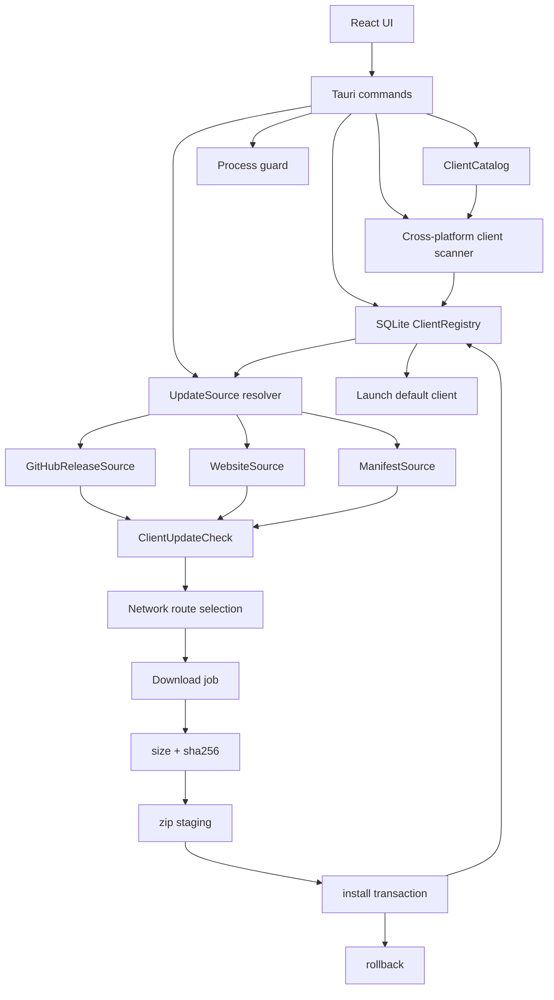

# DDNet Manager 下一步 MVP 完整规格

status: draft
date: 2026-06-07
scope: next-mvp-closeout
based_on:
- `docs/superpowers/specs/2026-06-06-ddnet-manager-prd.md`
- `docs/superpowers/specs/2026-06-06-backend-ab-strengthening.md`
- `docs/superpowers/plans/2026-06-06-ddnet-manager-mvp-plan.md`
- `docs/superpowers/plans/2026-06-07-network-route-selection-plan.md`
- `docs/superpowers/explore/2026-06-06-后端强化探索.md`
- `docs/superpowers/explore/2026-06-07-下载链路与GFW绕过方案.md`
- `docs/superpowers/explore/2026-06-07-GitHub更新源MVP与Gitee调查.md`
- `docs/superpowers/explore/2026-06-07-Gitee-manifest-json可用性调研.md`

## 速答

当前代码已经不是首版 mock：后端已拆出客户端扫描、SQLite 注册表、manifest 校验、下载任务、zip staging、安装回滚、网络路由、cfg 分析和 Workshop 读取；前端也已有启动页、全部游戏、更新、资源、Binds、设置页和集中 IPC 封装。

下一步 MVP 0.1.0 不应继续扩张页面，而应收口一个可发布的核心闭环：

**客户端管理闭环**：准确识别用户列出的各类 DDNet 兼容客户端，支持 Windows、macOS、Linux 三端扫描或手动添加，支持下载、校验、安装、保存默认客户端、启动客户端、检查更新和安全更新失败恢复。

资源、Binds、Workshop、cfg 写入等功能不进入 0.1.0 可发布范围。即使当前代码已有局部实现，0.1.0 产品界面也必须明确标注“当前版本不可用 / 后续版本添加”，或直接隐藏入口，避免用户以为这些能力已经可用。

本规格的核心调整是：**更新页不再要求普通用户手填 manifest URL**。MVP 应引入按客户端类型分派的更新检查器：GitHub ReleaseSource、WebsiteSource 或后续客户端专属 checker 才是正常主通道；ManifestSource 只作为备用更新发现机制保留。当使用 ManifestSource 时，Gitee raw 是推荐主托管路径。

本规格的第二个核心调整是：**客户端识别必须从真实发布资产和真实安装形态出发，并覆盖 Windows、macOS、Linux 三端**。当前代码里的 `ddnet_vanilla` 不是产品中真实存在的客户端类型，后续统一使用 `client_id = "ddnet"` 表示 DDNet 原版客户端；若本地注册表已有旧 ID，迁移层需要兼容读取并保存为新 ID。

## 当前代码现状总结

### 已经落地的后端能力

- `src-tauri/src/models.rs` 已包含客户端安装、扫描选项、网络路由、更新检查、下载任务、manifest、cfg 分析和 Workshop 类型。
- `src-tauri/src/client_scan.rs` 已支持验证客户端目录、扫描默认 roots、深度扫描选项和 Everything 意图入口。
- `src-tauri/src/registry.rs` 已提供 SQLite 客户端注册表，支持保存、删除、列出和设置默认客户端。
- `src-tauri/src/commands.rs` 已暴露客户端管理、启动、运行检测、manifest 加载、更新检查、下载、安装、cfg 分析和 Workshop 读取命令。
- `src-tauri/src/download.rs` 已提供下载任务创建、流式下载、size/sha256 校验、zip 安全解压、staging 客户端识别、安装替换、rollback 目录和恢复能力。
- `src-tauri/src/network_route.rs` 已提供直连、代理前缀、镜像模板候选与 manifest 路由探测选择基础。
- `src-tauri/src/cfg.rs` 已能分析 bind、unbind、exec、缺失 exec 目标和按键冲突。
- `src-tauri/src/file_tx.rs` 已能渲染 Manager 标记区块并做单文件备份基础。
- `src-tauri/src/workshop.rs` 已能消费 Workshop 公开 bind JSON。
- `src-tauri/src/process.rs` 已能解析启动目标、启动客户端，并基于进程信息判断目标是否运行。

### 已经落地的前端能力

- `src/lib/tauri.ts` 已集中封装主要 IPC，组件不再散落裸 `invoke`。
- `src/types.ts` 已同步多数后端 IPC 类型。
- `src/components/clients/ClientManager.tsx` 已支持手动验证保存、扫描候选、设置默认和移除记录。
- `src/components/update/UpdatePanel.tsx` 已接入默认客户端、更新检查、下载、安装、下载事件监听和基础网络路由输入。
- `src/components/resources/ResourcePanel.tsx` 已开始展示客户端路径与资源位置。
- `src/components/binds/BindsPanel.tsx` 已接入 cfg 分析与 Workshop 列表。
- `src/App.tsx` 已形成主应用壳、启动页、游戏列表、更新、资源、Binds 和设置入口。

### 0.1.0 仍未收口的关键缺口

- 更新发现仍强依赖用户手填 manifest URL，不符合普通用户 MVP 体验。
- manifest 与 GitHub Release、Website 下载页之间没有统一 `UpdateSource` 抽象。
- 客户端识别仍是路径名启发式，缺少内置 `ClientCatalog`；当前只识别 Windows 风格的 `DDNet.exe` / `ddnet.exe`，不能准确覆盖 macOS `.app` bundle、Linux 可执行文件和不同客户端真实资产名。
- `src-tauri/src/client_scan.rs` 当前会把 Steam 或 `DDNet` 目录标成 `ddnet_vanilla`，需要迁移为 `ddnet`。
- 下载任务和安装事务主要是进程内状态，应用重启后的任务恢复、历史记录和缓存清理尚未产品化。
- 网络路由已有后端核心，但缺少“自动检测系统代理、保存用户偏好、多路探测并选择”的完整用户流程。
- 错误仍以 `Result<_, String>` 为主，前端只能用字符串包含关系做用户提示映射。
- 资源页、Binds 页和 Workshop 页不应作为 0.1.0 可用能力发布；当前局部 UI / 后端能力要么隐藏，要么显示明确不可用状态。
- 真实桌面手动联调、真实 QmClient zip、错误 sha256、客户端运行中安装阻断等场景仍需要验收。

## MVP 目标

0.1.0 MVP 完成时，一个普通 Windows、macOS 或 Linux 用户应能在不理解 manifest、GitHub API 或 DDNet 目录结构的前提下完成以下流程：

1. 打开 DDNet Manager。
2. 让应用扫描或手动添加本机 QmClient、TaterClient / TClient、BestClient、Cactus Client、DDNet 原版官网下载版、DDNet Steam 版。
3. 设置默认客户端并一键启动。
4. 对每个已支持客户端看到清晰的识别结果、平台支持状态、安装来源、健康状态、兼容性状态、安装目录、可执行路径和版本信息。
5. 对支持自动更新的客户端检查更新，无需手填 manifest。
6. 在直连失败时选择系统代理、代理前缀或镜像下载方式。
7. 下载客户端资产，完成 size / sha256 校验。
8. Windows `.zip`、Linux `.tar.xz`、macOS `.dmg` 资产都必须进入 Manager-owned 安装闭环：下载、校验、staging、安装到 Manager 管理目录、版本记录、失败回滚。外部手动安装仍可注册，但不算 Manager-owned 安装完成。
9. 安装或更新失败时原客户端不被破坏，并能看到可恢复信息。
10. 对 Steam 版 DDNet 只做发现、注册、启动和打开 Steam 管理入口，不由 Manager 覆盖更新。

## MVP 非目标

- 不做账号、登录、收藏、评分、评论或 Workshop 发布。
- 不自动修改系统 hosts。
- 不接入系统级 DPI/TLS 分片工具。
- 不把 QmClient 开发仓库的 Release 目录作为用户更新源。
- 不把 Everything 作为硬依赖。
- 不做移动端管理；Android 包只作为上游资产事实记录，不进入桌面 MVP。
- 不把资源管理、Binds、Workshop、cfg 分析或 cfg 写入作为 0.1.0 可用功能；这些功能明确后续版本添加。
- 不要求 Cactus Client 自动下载和安装；官网未暴露稳定下载 URL / sha256 前，0.1.0 只做识别、启动和打开官网下载页。

## 真实客户端识别与三端兼容

### 调研结论

截至 2026-06-07，用户列出的客户端并没有全部“落实”为可准确识别、可跨平台扫描、可按客户端类型更新的产品能力。当前已落地的是 Windows 目录扫描和路径名启发式分类；MVP 必须补一个内置客户端目录 `ClientCatalog`，把“客户端类型、平台、发布资产、安装形态、可执行文件候选、更新源策略、识别置信度”从代码散落逻辑中抽出来。

真实发布信息如下：

| 客户端 | 真实来源 | 已确认桌面资产 | 校验信息 | MVP `client_id` | MVP 状态 |
| --- | --- | --- | --- | --- | --- |
| QmClient | GitHub `wxj881027/QmClient` | `QmClient-windows.zip`、`QmClient-windows.7z`、`QmClient-macOS.dmg`、`QmClient-ubuntu.tar.xz`；latest 当前重定向到 `v2.62.4` | GitHub expanded assets 暴露 sha256 摘要 | `qmclient` | 必须支持扫描、手动添加、启动、更新 |
| TaterClient / TClient | 官网 `tclient.app` 与 GitHub `TaterClient/TClient` | `TClient-windows.zip`、`TClient-macOS.dmg`、`TClient-ubuntu.tar.xz`；latest 当前为 `V10.8.7` | GitHub expanded assets 暴露 sha256 摘要 | `taterclient` | 必须支持识别和启动；自动更新可作为同构 GitHubReleaseSource |
| BestClient | GitHub `BestProjectTeam/BestClient` | `BestClient-windows.zip`、`BestClient-linux.tar.xz`；latest 当前重定向到 `v1.8`，未观察到 macOS 资产 | GitHub expanded assets 暴露 sha256 摘要 | `bestclient` | 必须支持识别和启动；macOS 标为不支持或未知 |
| Cactus Client | 官网 `https://cactuss.top/` | 页面显示 Windows `.zip`、Linux `.tar.xz`、macOS `.dmg`，版本 `1.15`，macOS 10.15+ | 官网页面未直接暴露 sha256 或稳定下载 URL | `cactusclient` | 必须支持识别和启动；更新采用 WebsiteSource，只打开下载页或半自动提示 |
| DDNet 原版 | 官网 `https://ddnet.org/downloads/` + GitHub `ddnet/ddnet` | 调研时官网下载页样例资产包括 `DDNet-19.8.2-win64.zip`、`DDNet-19.8.2-win-arm64.zip`、`DDNet-19.8.2-win32.zip`、`DDNet-19.8.2-linux_x86.tar.xz`、`DDNet-19.8.2-linux_x86_64.tar.xz`、`DDNet-19.8.2-macos.dmg`；实现不能写死版本号，必须动态解析官网下载页 / manifest；GitHub release/Atom 可确认版本，但 expanded assets 对 `19.8.2` 只暴露源码归档 | 官网提供 `sha256sums.txt` | `ddnet` | 必须支持官网下载版识别、Steam 版识别和启动；更新源优先用官网二进制与 sha256，GitHub 只作为版本/源码上游参考 |
| DDNet Steam | Steam app `412220` | Steam 页面支持 Windows、macOS、SteamOS + Linux | Steam 自身负责分发校验 | `ddnet` + `install_source = steam` | 必须支持扫描 Steam 库并启动；不由 Manager 覆盖安装 |

识别准确性分级：

| 级别 | 条件 | UI 表现 | 是否允许更新安装 |
| --- | --- | --- | --- |
| `verified` | 可执行文件、`storage.cfg`、`data/` 或 `.app` bundle 结构匹配，且目录名/发布资产名命中 catalog | 显示具体客户端名 | 允许进入该客户端的更新策略 |
| `compatible` | 结构像 DDNet 兼容客户端，但无法确认具体发行方 | 显示“DDNet 兼容客户端”或目录名 | 只允许启动和健康管理，不自动安装更新 |
| `partial` | 只命中可执行文件或只命中 `storage.cfg` | 显示缺失项 | 不允许启动或更新，允许用户修复路径 |
| `unsupported` | 已知客户端但当前平台无资产，例如 BestClient macOS | 显示“该客户端当前未发布此平台版本” | 不允许更新安装 |

### 三端安装形态

Windows 识别候选：

- 可执行文件：`DDNet.exe`、`ddnet.exe`，以及从 catalog 派生的发行包根目录。
- 常见位置：`Downloads`、`Desktop`、`Documents`、`Games`、`Program Files`、`Program Files (x86)`、`LOCALAPPDATA`、`APPDATA`、`C:/Games`、`D:/Games`、Steam `steamapps/common/DDNet`、开始菜单快捷方式目标。
- Steam 库：读取 `libraryfolders.vdf`，生成每个库的 `steamapps/common/DDNet` 候选，不做全盘递归。

macOS 识别候选：

- 应用 bundle：`DDNet.app`、客户端发行包内的 `.app`，可执行文件位于 `Contents/MacOS/`。
- 常见位置：`/Applications`、`~/Applications`、`~/Downloads`、`~/Desktop`、`~/Games`，以及 Steam `~/Library/Application Support/Steam/steamapps/common/DDNet` 和其他 Steam library folders。
- 健康检查不能要求根目录存在 `DDNet.exe`；应检查 `.app/Contents/MacOS/*`、bundle 元数据、`storage.cfg` 或可从包内推导的 data 目录。

macOS 多客户端 / 多版本共存策略：

- `.dmg` 只是磁盘镜像，用户按常规方式把里面的 `DDNet.app` 拖到 `/Applications` 时，同名 app bundle 会覆盖旧安装。
- 0.1.0 不能把“拖到 `/Applications`”作为多客户端安装方案；这会破坏 QmClient、TaterClient、DDNet 原版等多个同名 bundle 共存。
- Manager 管理的 macOS 客户端应放到独立目录，例如 `~/Applications/DDNet Manager/` 或 Manager app data 下的 `clients/{client_id}/{version}/`。
- 复制 `.app` bundle 时必须使用唯一 bundle 目录名，例如 `DDNet-Official.app`、`QmClient.app`、`TClient.app`、`BestClient.app`、`CactusClient.app`，或 `DDNet-19.8.2.app`。
- 如果用户手动把 app 放在 `/Applications/DDNet.app`，Manager 默认只注册和启动该安装，不应静默覆盖它。
- `/Applications/DDNet.app` 可以进入版本控制，但必须由用户显式选择“接管此安装”。接管后 Manager 需要记录所有权、当前版本、备份路径和回滚点；更新前展示“覆盖现有安装”与“安装为独立副本”两个选择。
- 未接管的 `/Applications/DDNet.app` 视为外部安装，只做识别、启动和打开位置；接管后的 `/Applications/DDNet.app` 才允许进入 Manager 的更新、备份和回滚链路。
- 启动时使用具体 `.app/Contents/MacOS/*` 路径或系统 open 能力指向具体 bundle，不能只按 bundle 名查找。
- 后续如要修改 bundle 显示名或 `Info.plist`，必须先验证签名、Gatekeeper 和 quarantine 行为；0.1.0 优先只改外层 bundle 目录名，不改包内元数据。

### 运行兼容性识别

0.1.0 不只验证“客户端目录像不像 DDNet”，还必须真实检测“当前机器能不能启动客户端”。不能主要依赖上游兼容性声明，因为多数第三方客户端不会完整写最低系统要求。用户曾遇到 Windows 7 无法打开 QmClient，这类场景必须在客户端列表和启动页明确显示。

新增兼容性模型：

```json
{
  "compatibility": {
    "status": "unsupported",
    "can_launch": false,
    "launch_verified": false,
    "reasons": [
      {
        "code": "windows_version_too_old",
        "message": "当前系统是 Windows 7，该客户端未声明支持 Windows 7。"
      }
    ],
    "last_launch_result": null
  }
}
```

状态定义：

| 状态 | 含义 | UI 文案 |
| --- | --- | --- |
| `supported` | 已知平台、OS 版本、CPU 架构和基本运行条件匹配 | `可启动` |
| `unsupported` | 已知不满足最低系统要求或当前平台无资产 | `当前系统不可用` |
| `risky` | 基本条件满足，但存在缺依赖、过旧系统、权限、quarantine、GPU/API 等风险 | `可能无法启动` |
| `unknown` | 上游未声明最低系统，Manager 只能做文件和架构检查 | `兼容性未知，建议手动测试启动` |
| `verified` | Manager 曾成功启动该客户端并观察到进程稳定运行一段时间 | `已验证可启动` |

兼容性检查项必须来自本机真实检测，按证据强度分层：

- 当前 OS：Windows 版本、macOS 版本、Linux 发行版和内核只做展示，不硬编码发行版歧视。
- CPU 架构：x86、x86_64、arm64 与资产名匹配，例如 Windows ARM、macOS universal、Linux x86_64。
- 文件格式：Windows 解析 PE header，macOS 解析 Mach-O / universal binary，Linux 解析 ELF header，确认 CPU 架构和最低 loader 条件。
- 依赖检查：Windows 检查常见 VC++ runtime / DLL 加载失败风险，Linux 检查可执行权限和动态库缺失风险，macOS 检查 bundle 可执行权限、quarantine 标记和 Gatekeeper 风险。
- 平台版本：Windows 检查系统版本和 PE subsystem 版本；macOS 检查系统版本与 bundle / Mach-O 架构；Linux 检查内核、glibc / libc 风险和只读安装路径。
- 图形能力：DDNet / 兼容客户端通常依赖 OpenGL；0.1.0 至少做能力提示和失败归因，后续再做更细的 GPU 探测。
- 受控启动探测：提供“测试启动”动作，真实启动目标客户端并观察短时间内是否创建进程、是否立即退出、是否返回 loader 错误。探测需要可取消，不能写 cfg，不能默认进入全屏，失败原因要持久化。
- 启动记录：成功启动后记录 `last_launch_result = success` 和时间；失败时记录退出码、错误类别和最近 stderr / crash dump 位置提示。
- 上游声明：只作为辅助证据进入 `ClientCatalog.compatibility`，不能替代本机检测。
- 游玩状态：0.1.0 不承诺自动证明“可正常游玩、可进服务器、渲染和输入全部正常”。UI 只能显示 `已验证可启动`；“可游玩”需要用户手动确认或后续专门的游戏内探测能力。

已知兼容性来源：

- Steam DDNet 页面声明 Windows 最低系统为 Windows 10 or newer，因此 Steam DDNet 在 Windows 7 上应显示不支持。
- Cactus Client 官网声明 macOS 10.15+，因此低于 10.15 的 macOS 应显示不支持。
- QmClient、TaterClient、BestClient 若上游 release 未明确最低 Windows 版本，0.1.0 不能假装支持 Windows 7；必须结合 PE / 依赖 / 受控启动探测结果显示 `supported`、`risky`、`unsupported` 或 `verified`。

UI 要求：

- 客户端列表每条记录显示“健康状态”和“兼容性状态”，二者分开。健康状态表示文件齐不齐，兼容性表示当前机器能不能运行。
- 启动按钮旁边显示 `可启动`、`可能无法启动`、`当前系统不可用` 或 `已验证可启动`。
- `unsupported` 禁用启动按钮，除非用户在高级设置中启用“仍然尝试启动”。
- `risky` 允许用户尝试启动，但必须展示风险原因，例如 `Windows 7 可能无法打开该客户端`。
- 一次启动失败后，列表中保留失败原因，避免用户重复盲点。

Linux 识别候选：

- 可执行文件：`DDNet`、`ddnet` 或发行包内主可执行文件，必须是 regular file 且具有可执行权限。
- 常见位置：`~/Downloads`、`~/Desktop`、`~/Games`、`~/Applications`、`~/.local/share`、`/opt`、`/usr/local/games`，以及 Steam `~/.steam/steam/steamapps/common/DDNet`、`~/.local/share/Steam/steamapps/common/DDNet` 和 library folders。
- `.tar.xz` 解压目录通常包含主可执行文件、`storage.cfg`、`data/`；权限缺失时提示用户修复，不自动 `chmod` 非 Manager 安装的目录。

### 内置 ClientCatalog

MVP 新增静态 catalog，而不是继续把识别规则写死在 `infer_client_identity`：

```json
{
  "client_id": "qmclient",
  "display_name": "QmClient",
  "aliases": ["QmClient", "qm-client"],
  "supported_platforms": ["windows", "macos", "linux"],
  "executable_candidates": {
    "windows": ["DDNet.exe", "ddnet.exe"],
    "macos": ["*.app/Contents/MacOS/*"],
    "linux": ["DDNet", "ddnet"]
  },
  "required_markers": ["storage.cfg", "data"],
  "update_source": {
    "type": "github_release",
    "owner": "wxj881027",
    "repo": "QmClient",
    "asset_patterns": {
      "windows": ["QmClient-windows.zip"],
      "macos": ["QmClient-macOS.dmg"],
      "linux": ["QmClient-ubuntu.tar.xz"]
    }
  }
}
```

Catalog 至少包含：

- `qmclient`
- `taterclient`
- `bestclient`
- `cactusclient`
- `ddnet`
- `third_party` 作为无法确认发行方但结构兼容的 fallback

`ddnet` 的特殊规则：

- `display_name` 使用 `DDNet` 或 `DDNet 原版客户端`。
- `install_source` 区分 `official_download`、`steam`、`manual`。
- 旧数据中的 `ddnet_vanilla` 只作为迁移输入，不能继续写入新记录。
- Steam 安装不允许 Manager 覆盖更新，只允许打开 Steam 或启动本地客户端。

### 调研来源

- DDNet 官网下载页：<https://ddnet.org/downloads/>
- DDNet 官网 SHA256：<https://ddnet.org/downloads/sha256sums.txt>
- DDNet GitHub 仓库：<https://github.com/ddnet/ddnet>
- DDNet GitHub releases：<https://github.com/ddnet/ddnet/releases>
- DDNet Steam 页面：<https://store.steampowered.com/app/412220/DDNet/>
- QmClient latest release：<https://github.com/wxj881027/QmClient/releases/latest>
- QmClient expanded assets 样例：<https://github.com/wxj881027/QmClient/releases/expanded_assets/v2.62.4>
- TaterClient 官网：<https://tclient.app/>
- TaterClient / TClient latest release：<https://github.com/TaterClient/TClient/releases/latest>
- TaterClient expanded assets 样例：<https://github.com/TaterClient/TClient/releases/expanded_assets/V10.8.7>
- BestClient latest release：<https://github.com/BestProjectTeam/BestClient/releases/latest>
- BestClient expanded assets 样例：<https://github.com/BestProjectTeam/BestClient/releases/expanded_assets/v1.8>
- Cactus Client 官网：<https://cactuss.top/>

## 统一架构



架构原则：

- 后端负责文件系统、进程、网络、下载、校验、解压、安装和回滚。
- 前端负责选择、确认、展示状态和用户可理解的错误信息。
- 更新发现和下载执行分离：更新源只产出统一 `ClientUpdateCheck`，下载层只执行 URL 路由、下载、校验和安装。
- manifest 是可选更新源，不再是所有客户端的唯一入口。
- 所有写入用户文件或安装目录的操作必须可恢复。
- 资源、Binds、Workshop 和 cfg 写入不进入 0.1.0 可用架构，只作为后续版本模块保留。

## 核心领域模型

### UpdateSource

新增统一更新源配置：

```json
{
  "client_id": "qmclient",
  "display_name": "QmClient",
  "default_channel": "stable",
  "source": {
    "type": "github_release",
    "owner": "wxj881027",
    "repo": "QmClient",
    "release_policy": "latest_non_prerelease",
    "asset_patterns": [".zip", "win", "x64"],
    "sha256_policy": "manifest_or_digest_required"
  }
}
```

支持三种 source：

| 类型 | MVP 用途 | 输出 |
| --- | --- | --- |
| `github_release` | QmClient、TaterClient、BestClient 等 GitHub 托管第三方客户端；正常主通道之一 | 读取 release/tag 和 asset，输出统一更新检查结果 |
| `website` | Cactus Client 等独立站下载；正常主通道之一 | 打开下载页或输出半自动下载信息 |
| `manifest` | 备用更新发现通道；推荐主托管为 Gitee raw | 复用现有 manifest 解析和校验 |

`sha256_policy` 必须显式。GitHub Release 如果无法取得可靠 sha256，MVP 不应静默安装；可以提示“该更新源缺少校验信息”，或要求项目维护的轻量校验 manifest 作为补充。

### Manifest 自动更新

ManifestSource 的 manifest 文件不应由应用运行时自动写远端，也不应长期手工维护。MVP 采用“维护端自动生成，应用端自动刷新”的双层策略。

维护端职责：

- 由 GitHub Actions、维护者本机脚本，或能稳定访问 GitHub 与 Gitee 的自托管 runner 读取上游 GitHub Release / tag / 手工配置。
- 选择符合平台和命名规则的资产。Windows 优先支持 `.zip`，Linux 需要识别 `.tar.xz`，macOS 需要识别 `.dmg` 或 `.app` bundle。
- 获取或计算 `sha256` 和 `size`。
- 生成 `manifest.json`。
- 用本项目 parser 校验 manifest 结构。
- 提交或推送到 Gitee raw 所在公开仓库。
- 保留最近若干次 manifest 历史，便于排查错误发布。

不要把 manifest 生成放到 Gitee CI。Gitee CI 访问 GitHub 仍可能受网络影响，会把用户侧 GitHub 不可达问题转移成发布侧不可达问题。Gitee 在该链路中只作为静态 raw 托管目标，manifest producer 应从 GitHub 侧或维护者可控网络环境向 Gitee 推送结果。

应用端职责：

- 每次用户点击“检查更新”时请求远端 manifest。
- 本地缓存最近一次成功 manifest。
- 远端不可达时允许使用未过期的本地缓存做只读展示，但下载前仍要使用 manifest 中的 sha256 校验资产。
- 记录 manifest URL、ETag 或 last modified 信息，避免短时间内重复请求。
- 当 manifest schema 不兼容时展示“更新源需要新版 Manager”，而不是继续下载。

推荐 manifest 增加元数据字段：

```json
{
  "schema_version": 1,
  "generated_at": "2026-06-07T12:00:00Z",
  "source": "github_release",
  "source_revision": "wxj881027/QmClient@v2.62.5",
  "min_manager_version": "0.1.0",
  "clients": []
}
```

`generated_at`、`source`、`source_revision` 和 `min_manager_version` 可作为向后兼容字段引入。老客户端不依赖这些字段，新客户端用它们做诊断和兼容提示。

### ClientRegistry

继续使用 SQLite 保存客户端安装记录。MVP 需要保证以下字段可靠：

- `id`
- `client_id`
- `display_name`
- `install_dir`
- `executable_path`
- `storage_cfg_path`
- `data_dir`
- `user_data_dir`
- `version`
- `is_default`
- `health`
- `last_scanned_at`

后续可扩展但 MVP 应优先补齐：

- 最近启动时间。
- 最近更新检查时间。
- 最近成功安装版本。
- 更新源类型和 channel 偏好。
- `install_source`：`official_download`、`steam`、`manual`、`manager`。
- `confidence`：`verified`、`compatible`、`partial`、`unsupported`。
- `compatibility`：当前系统是否可启动、启动验证状态、原因列表和最近一次启动结果。

### DownloadJob

现有进程内 `DownloadJob` 继续作为运行时模型。MVP 为了可验收，应至少持久化已完成或失败的安装历史：

- job id。
- client installation id。
- source type。
- version。
- asset url 原始地址。
- route mode。
- status。
- error summary。
- rollback path。
- completed at。

下载中断后的断点续传可以后置，但缓存清理和失败记录必须进入 MVP。

### 0.1.0 暂不启用的模型

`BindInstallPlan`、资源路径 resolver、Workshop adapter 和 cfg writer 不属于 0.1.0 发布范围。当前仓库已有的相关类型和局部实现可以保留，但产品入口必须隐藏或显示“当前版本不可用，后续版本添加”。后续重启这些能力时，必须重新写独立规格和实现计划。

## 后端规格

### 1. 客户端管理

保留并强化现有命令：

- `scan_client_installations(options)`
- `validate_client_dir(path)`
- `upsert_client_installation(request)`
- `remove_client_installation(id)`
- `set_default_client(id)`
- `list_client_installations()`
- `get_default_client()`
- `launch_client(path)`
- `is_client_running(path)`

必须补齐的行为：

- `scan_client_installations` 返回候选时不能把所有结果强行显示为 QmClient；识别不足时应使用 `third_party`。
- `scan_client_installations` 必须基于 `ClientCatalog` 和当前平台选择候选文件，不能在 macOS/Linux 上继续要求 `DDNet.exe`。
- `ddnet_vanilla` 必须作为旧记录兼容输入迁移到 `ddnet`；新扫描、新保存和新 manifest 都不得再写出 `ddnet_vanilla`。
- 健康状态应能表达多个缺失项。当前单枚举可以保留，但 UI 要展示具体缺失原因；后端下一步推荐扩展 `missing_items`。
- 默认扫描只扫描当前平台常见路径、Steam 库和历史路径，深度扫描必须由用户触发。
- Everything 只作为可选 provider。不可用时返回普通扫描结果，不报错。
- 启动前必须重新验证默认客户端健康状态。

### 2. 更新源解析

新增模块建议：

- `src-tauri/src/update_source.rs`：更新源配置、分派和统一输出。
- `src-tauri/src/github_release.rs`：GitHub releases API adapter。
- `src-tauri/src/website_source.rs`：网站型客户端 adapter，MVP 可先只返回打开网页动作。

`check_client_update` 应改为：

```text
check_client_update(client_id, channel)
  -> 读取内置或本地保存的 UpdateSource 配置
  -> 按 source.type 分派
  -> 输出 Option<ClientUpdateCheck>
```

前端不再传 `manifest_url` 作为主流程参数。正常流程由默认客户端的更新检查器决定来源：GitHub ReleaseSource、WebsiteSource 或后续客户端专属 checker。ManifestSource 仍可在高级设置或备用通道入口显式配置；默认建议使用公开 Gitee raw URL，并由后端处理受控重定向到 `raw.giteeusercontent.com`。

GitHub ReleaseSource MVP 要求：

- 读取 latest release 或按 channel 选择 prerelease。
- 提取版本号，统一去掉前缀 `v` 后比较。
- 按 `ClientCatalog.asset_patterns[current_platform]` 匹配当前平台资产。
- 优先读取 GitHub expanded assets 中公开的 digest；若 GitHub asset 或补充 manifest 提供 sha256，则允许下载。
- 若缺少 sha256，返回明确错误，不进入安装。
- 缓存短时间内的检查结果，避免频繁触发 GitHub API 限流。

WebsiteSource MVP 要求：

- Cactus Client 这类官网源默认不做网页抓取式自动安装。
- 若官网没有公开稳定下载 URL 和 sha256，更新检查只输出“打开官网下载页”和当前可见版本信息。
- 用户手动下载后可通过手动添加/重新扫描纳入管理。
- 后续若维护者补充 manifest，可把 WebsiteSource 退到展示用途，由 ManifestSource 提供可校验下载。

### 3. 网络路由

保留现有三种模式：

- `direct`
- `proxy_prefix`
- `mirror_template`

MVP 用户流程：

1. 默认直连。
2. 直连失败时提示用户启用代理或镜像。
3. 用户配置 HTTPS 代理前缀或镜像模板。
4. 后端将 route host 加入本次请求的 `enabled_hosts`。
5. manifest、GitHub API 和 asset 下载都必须经过相同安全校验。
6. 所有下载完成后强制 size 与 sha256 校验。

下一步推荐补齐：

- Windows 系统代理检测。
- 保存用户网络偏好。
- 用真实 HTTP 请求探测 route，而不是 ping。
- 多 route 失败聚合错误，前端展示“直连失败、代理失败、镜像失败”的可读摘要。

### 4. 下载与安装事务

现有下载事务方向正确，MVP 需要把验收边界明确下来：

- 下载写入 app cache，不直接覆盖客户端目录。
- 下载过程发送 `download-progress`。
- 下载完成后自动校验 size 和 sha256。
- Windows `.zip` 解压到 staging，拒绝绝对路径和路径穿越。
- Linux `.tar.xz` 必须安全解包到 staging，拒绝绝对路径、路径穿越和权限异常，再安装到 Manager 管理目录。
- macOS `.dmg` 必须完成下载和 sha256 校验；Manager-owned 安装需要挂载或解包 dmg、复制 `.app` bundle 到 Manager 管理目录、记录版本、备份和回滚点。若当前环境无法安全自动挂载/复制，则该客户端不能标为 0.1.0 自动安装完成。
- staging 中必须按平台识别主可执行文件、`storage.cfg` 和 `data/` 或 `.app` bundle，而不是只识别 `DDNet.exe`。
- 安装前再次检查目标客户端未运行。
- rollback 目录放在安装目录同级或具备跨盘 copy fallback。
- 文件替换成功但注册表更新失败时必须尝试恢复 rollback。
- 安装成功后更新注册表版本。
- 失败时保留足够信息给用户重试或人工恢复。

MVP 可不做断点续传，但要支持取消下载和清理失败缓存。

### 5. 资源、Binds 与 Workshop 禁用策略

0.1.0 不发布资源管理、Binds、Workshop 或 cfg 写入。后端已有命令如果暂时保留，前端不得把它们作为可用主流程暴露。

发布要求：

- 导航中隐藏资源和 Binds 入口，或显示禁用态。
- 禁用态文案必须明确：`当前版本不可用，后续版本添加`。
- 不允许在 0.1.0 中写入 settings、autoexec、Manager 专用 cfg 或任何用户资源目录。
- 不允许把裸 JSON 调试输出作为 0.1.0 功能页面。

## 前端规格

### 信息架构

0.1.0 主导航只保留可发布闭环：

- 启动。
- 客户端。
- 更新。
- 设置。

资源、Binds、Workshop 入口在 0.1.0 隐藏或禁用，不作为可用导航项。客户端管理入口必须稳定可见，不能只藏在临时组件里。

### 启动页

启动页必须展示：

- 默认客户端。
- 健康状态。
- 安装路径。
- 版本。
- 最近更新检查状态。
- 启动按钮。

未配置默认客户端时，主操作应引导扫描或手动添加，而不是显示“准备就绪”。

### 更新页

更新页必须移除普通流程中的 manifest 输入框。用户看到的是：

- 当前默认客户端。
- 渠道选择。
- 更新源类型。
- 网络方式。
- 检查更新。
- 下载。
- 安装。
- 错误与恢复建议。

高级调试区可以保留 ManifestSource 输入，但默认折叠，且文案明确“自维护 manifest / 调试用途”。

### 客户端页

客户端页必须是 0.1.0 主工作区，覆盖：

- 扫描当前平台常见目录。
- 手动添加安装目录或 `.app`。
- 展示所有已注册客户端。
- 设置默认客户端。
- 移除注册记录。
- 打开安装目录。
- 打开官网下载页、GitHub release 页或 Steam 管理入口。
- 对每条记录显示 `client_id`、展示名、平台支持、安装来源、是否 Manager 接管、识别置信度、健康状态、兼容性状态、最近启动结果、版本、安装目录、可执行路径。
- 外部安装、Manager-owned 安装、Steam 安装必须用不同状态展示；外部安装不能误显示为可由 Manager 覆盖更新。

路径不确定时提供“重新扫描”或“手动指定”，不能猜测后继续打开或更新。

### 资源与 Binds 页

0.1.0 不发布资源页与 Binds 页。若 UI 暂时保留入口，页面只能显示不可用状态：

```text
当前版本不可用，后续版本添加。
```

不允许在 0.1.0 页面中提供 cfg 分析、Workshop 列表、bind 安装、资源写入或裸 JSON 调试输出。

### 设置页

MVP 设置项：

- 网络方式：直连、系统代理、代理前缀、镜像模板。
- GitHub token：高级可选，不默认要求。
- 扫描设置：排除路径、是否使用 Everything。
- 实验功能：manifest 自定义源、WebsiteSource 调试。

设置变更后应持久化，并刷新 Rust 侧运行时配置。

## 阶段方案

### 阶段 0：客户端识别与三端扫描收口

目标：让 0.1.0 能准确管理用户列出的客户端，而不是只识别 QmClient 或 Windows `DDNet.exe`。

交付：

- 新增 `ClientCatalog`。
- 迁移 `ddnet_vanilla` 为 `ddnet`。
- Windows、macOS、Linux 分平台扫描 roots。
- Steam libraryfolders 三端解析。
- 客户端识别置信度和安装来源字段。
- 兼容性真实检测模型和 UI 状态，包括 Windows 7 / Windows 10、macOS 版本、Linux 执行权限、CPU 架构、二进制格式、依赖风险和受控启动探测。
- QmClient、TaterClient、BestClient、Cactus Client、DDNet 原版、DDNet Steam 的识别规则。
- 资源/Binds 入口隐藏或禁用。

验收：

- 每个支持平台都能手动添加本机客户端。
- Windows 能扫描常见目录和 Steam DDNet。
- macOS 能识别 `.app` bundle 和 Steam DDNet。
- macOS 能同时注册多个不同路径或不同 bundle 名的 DDNet 兼容客户端，不会把它们折叠成一个 `/Applications/DDNet.app`。
- macOS 已有 `/Applications/DDNet.app` 默认只注册；只有用户显式选择“接管此安装”后，才进入版本控制、备份和回滚链路。
- Linux 能识别可执行文件权限、`.tar.xz` 解压目录和 Steam DDNet。
- Windows 7 上通过 PE / 依赖 / 受控启动探测给出真实兼容性状态；不能只因上游没写最低系统就显示可用。
- 启动失败后客户端列表能保留失败原因。
- `ddnet_vanilla` 不再被新记录写出。
- 资源/Binds 页面不会显示可操作功能。

### 阶段 1：更新源模型收口

目标：移除普通用户对 manifest URL 的依赖。

交付：

- 新增 `UpdateSource` 类型。
- 新增内置客户端更新源配置。
- 新增 GitHubReleaseSource adapter。
- 新增 DDNetSource：用 `ddnet/ddnet` GitHub release/Atom 作为官方版本参考，用 `ddnet.org/downloads/` 获取桌面二进制资产和 `sha256sums.txt`。
- 新增 WebsiteSource，Cactus Client 先只打开官网下载页或展示手动下载提示。
- 新增 manifest 生成与校验脚本方案，明确推送到 Gitee raw 的维护流程。
- `check_client_update` 按 `client_id + channel` 分派。
- 前端更新页默认不显示 manifest 输入。

验收：

- 设置默认 QmClient、TaterClient、BestClient 或 DDNet 原版后，点击检查更新无需输入 manifest。
- 缺少 sha256 时返回可读错误，不进入下载。
- Cactus Client 显示 WebsiteSource 手动下载/打开官网，不伪装成自动更新。
- ManifestSource 仍能通过高级入口工作，Gitee raw URL 能作为默认 manifest 托管地址使用。
- manifest 生成脚本产物能被 `parse_manifest` 校验通过。

### 阶段 2：网络与下载体验收口

目标：让下载链路对国内 GitHub 网络不可达有可操作方案。

交付：

- 网络设置持久化。
- 直连失败后可切换代理或镜像。
- 下载 route host 安全校验覆盖 manifest/GitHub API/asset。
- 下载失败错误分类展示。
- 失败缓存清理入口。

验收：

- 错误代理 host 被拒绝。
- 私网、localhost、HTTP URL 被拒绝。
- 代理下载后 sha256 仍强制校验。
- 错误 sha256 不安装，且不会破坏现有客户端。

### 阶段 3：下载、安装事务与注册表一致性验收

目标：证明真实客户端下载安装不会破坏已有客户端，并让各平台都有完整可用的管理路径。

交付：

- 使用小型测试 zip 的端到端验收资产。
- QmClient / TaterClient / BestClient Windows zip 自动安装。
- Linux `.tar.xz` 和 macOS `.dmg` 必须完成 Manager-owned 安装闭环；只打开安装包/引导用户手动安装不算自动安装完成。
- macOS 自动安装如果进入 0.1.0，必须安装到 Manager 管理的独立 bundle 路径，不默认覆盖 `/Applications/DDNet.app`。
- macOS 覆盖 `/Applications/DDNet.app` 只允许在用户显式接管并确认覆盖后发生，且必须有备份和回滚点。
- DDNet Steam 只走发现、注册、启动和打开 Steam 管理入口。
- 安装前运行中检测。
- rollback 同盘策略或跨盘 fallback。
- 安装历史持久化。
- 注册表更新失败恢复测试。

验收：

- 客户端运行时安装被阻断。
- staging zip 路径穿越被拒绝。
- 安装失败后原目录仍可验证为健康。
- 安装成功后注册表版本更新。
- macOS/Linux 用户不会看到不可执行的 Windows 专属安装按钮。

### 阶段 4：启动页与设置页产品化

目标：让用户清楚知道 Manager 当前管理哪个客户端，以及 0.1.0 哪些功能不可用。

交付：

- 默认客户端状态卡。
- 兼容性状态卡，展示 `可启动`、`可能无法启动`、`当前系统不可用` 或 `已验证可启动`。
- 客户端目录打开按钮。
- 未配置状态引导。
- 启动前健康复检。
- 资源/Binds 禁用入口或隐藏入口。
- 设置中保留网络、扫描、GitHub token 和高级 manifest 调试。

验收：

- 未配置客户端时不能启动。
- 缺文件客户端显示明确原因。
- 不兼容客户端显示明确原因，且默认不让用户误以为能正常游玩。
- 用户能打开安装目录或上游下载/管理页面。
- 启动默认客户端走注册表记录，不要求用户再次输入路径。
- 资源/Binds 如仍显示入口，只显示“当前版本不可用，后续版本添加”。

## 默认验收矩阵

自动验收：

```bash
make rust-test
make rust-check
make check
make check-lint
make build
```

手动验收：

- `make tauri-dev` 打开桌面应用。
- Windows：扫描或手动添加 QmClient、TaterClient、BestClient、Cactus Client、DDNet 原版下载版、DDNet Steam 版。
- macOS：手动添加或扫描 `.app` bundle；验证 QmClient、TaterClient、Cactus Client、DDNet 原版/Steam 的可管理路径；BestClient 显示平台不支持或未知。
- Linux：手动添加或扫描 `.tar.xz` 解压目录；验证 QmClient、TaterClient、BestClient、Cactus Client、DDNet 原版/Steam 的可管理路径。
- 设置默认客户端并启动。
- 对支持自动更新的客户端检查更新。
- 使用测试 zip 下载、校验和安装。
- Linux `.tar.xz`、macOS `.dmg` 验证 Manager-owned 安装、版本记录和失败回滚；手动外部安装只作为注册流程验收。
- 客户端运行时尝试安装，确认被阻断。
- 使用错误 sha256，确认下载后拒绝安装。
- 使用路径穿越 zip，确认解压被拒绝。
- Cactus Client 显示打开官网或手动下载提示，不进入无校验自动安装。
- DDNet Steam 显示 Steam 管理入口，不由 Manager 覆盖更新。
- 资源/Binds 入口隐藏或明确显示“当前版本不可用，后续版本添加”。

## 风险与决策

### sha256 来源

GitHub ReleaseSource 不保证所有项目都发布 sha256。MVP 决策是：缺少可靠 sha256 时不自动安装。可以通过项目自维护校验 manifest 补齐，但不能绕过校验。

### GitHub API 限流

未认证 GitHub API 会按 IP 限流。MVP 通过短时缓存和失败提示处理；GitHub token 只作为高级设置。

### 公共代理不稳定

不硬编码公共代理列表。用户显式配置代理或镜像，后端只在本次请求中启用对应 host，并始终做 sha256 校验。

### 安装目录占用、权限与挂载状态

Windows 下正在运行的客户端可能占用文件；macOS `.app` 可能处于 Gatekeeper / quarantine / 已挂载 dmg 状态；Linux 解压目录可能缺少执行权限或位于只读路径。安装前和替换前都必须检测运行状态和目标路径可写性；检测失败时保守拒绝自动安装，改为提示用户手动处理。

### 0.1.0 范围外功能误发布风险

资源、Binds、Workshop、cfg 分析和 cfg 写入已有局部代码，但 0.1.0 不承诺这些功能。发布前必须检查导航、按钮、IPC 调用和文案，避免用户触达未完成流程；如果入口保留，必须只显示不可用状态。

## 完成定义

0.1.0 MVP 标记完成必须同时满足：

- 普通用户不需要手填 manifest URL 就能检查支持自动更新的客户端更新。
- QmClient、TaterClient / TClient、BestClient、Cactus Client、DDNet 原版官网下载版、DDNet Steam 版都有明确的识别、注册、启动和平台支持策略。
- Windows、macOS、Linux 三端都有可用的扫描或手动添加流程。
- 兼容性状态来自本机真实检测和受控启动探测，能明确显示当前机器是可启动、不可用还是存在启动风险，并展示原因；Windows 7 这类旧系统不能只显示“健康正常”。
- 默认客户端能保存、启动、重新验证健康状态。
- 下载真实资产时有进度、size/sha256 校验和错误恢复。
- Windows `.zip` 自动安装有 staging、rollback 和失败恢复。
- Linux `.tar.xz`、macOS `.dmg` 必须完成 Manager-owned 安装闭环；如果某客户端缺少稳定下载 URL 或校验信息，只能标为手动外部安装，不能计入自动安装完成。
- macOS 支持多个 DDNet 兼容 `.app` 共存；Manager 安装或引导安装不能默认覆盖同名 `/Applications/DDNet.app`，但用户可显式接管该安装并纳入版本控制、备份和回滚。
- Steam DDNet 只由 Manager 管理启动和定位，不覆盖 Steam 安装目录。
- 直连不可用时存在可配置代理或镜像路径，且安全校验不被放宽。
- 资源、Binds、Workshop、cfg 分析和 cfg 写入在 0.1.0 中隐藏或显示明确不可用状态。
- `make check-lint` 通过；如只跑局部检查，交付说明必须明确缺口。
- 至少完成一次 `make tauri-dev` 桌面手动联调；如果当前机器只能覆盖 Windows，需要在发布清单中明确 macOS/Linux 由对应平台补验。
