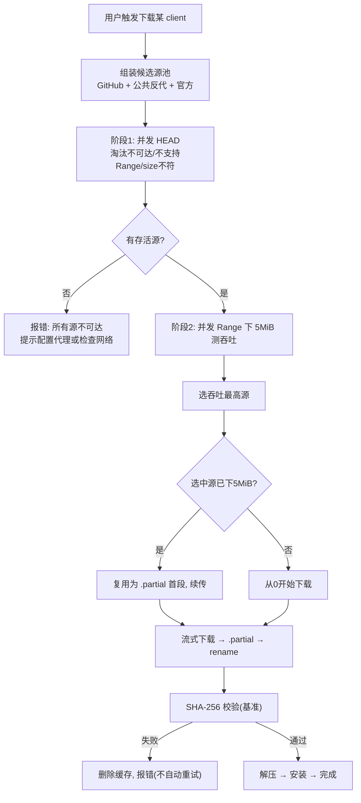

# DDNet Manager 下载加速与多源竞速方案

status: draft
date: 2026-06-24
scope: download-acceleration-large-assets
supersedes_partial: `explore/2026-06-07-下载链路与GFW绕过方案.md`（用"竞速择优"取代其"分层降级"）
note: |
  路线变更（2026-06-24，鸢天决策）：
  - manifest 已内置在软件（ClientCatalog），不再使用外部 manifest 托管。6/7 的 Gitee manifest / 外部 manifest 路线整体废弃。
  - 不采用任何自建镜像基础设施：Gitee / GitLab·极狐 / 蓝奏云 均已评估否决（理由见"已评估并否决的方案"）。
  - 方向收敛为：GitHub 官方直连 + 公共反代兜底 + 多源竞速，零基础设施维护。

## 速答

本方案让国内用户下载客户端大文件（几十 MB 的 zip / dmg / tar.xz）接近本地宽带满速，并覆盖挂代理与裸连两类用户。

做法是**多源竞速择优**：把 GitHub 直连、公共反代（gh-proxy 等）、官方源放在一起实测吞吐，谁快用谁。关键取舍是——**GitHub 直连必须是平等候选而非降级兜底**，因为挂了本地代理/VPN 的用户，经自己代理直连 GitHub 往往最快最稳，再绕去镜像反而更慢。

候选源池（**全部指向同一文件、同 SHA-256**）：

```text
① GitHub browser_download_url   ← 主源，挂代理用户最优
② 公共反代（gh-proxy 等）        ← 裸连用户降级兜底，列表外部化可热更新
③ ddnet.org 官方                 ← DDNet 原版专用
```

零基础设施维护：不搭任何自建镜像 / 对象存储 / 同步 CI。这是本方案与早期"分层降级 + 自建镜像"设想的最大区别。

## 定位与非目标

下载链路分三层，本方案只动一层：

| 层次 | 职责 | 归属 | 本方案 |
| --- | --- | --- | --- |
| 更新发现 | 找到"有新版本 + 下载地址" | 内置 `ClientCatalog` + `GitHubReleaseSource`/`WebsiteSource` 分派 | ❌ 不改 |
| 大文件 asset 下载加速 | 从最优源下载几十 MB 包 | **当前空白**（仅直连 + 用户自配代理） | ✅ **本方案** |
| （已废弃）外部 manifest 托管 | 拉远端 manifest.json | — | ❌ manifest 已内置，路线废弃 |

非目标：
- 不改更新发现（ClientCatalog / source 分派保持不变）。
- 不实现 TLS 分片 / DPI 绕过（需系统级驱动，与 reqwest/Tauri 架构冲突）。
- 不默认修改系统 hosts。
- 不依赖单一公共服务，也不维护自建镜像基础设施。
- 不采用 Gitee / GitLab / 蓝奏云（见下）。

## 已评估并否决的方案

记录决策依据，避免后续重复调研踩坑。

| 方案 | 否决理由 |
| --- | --- |
| **Gitee 托管** | 单文件 100MB 限制 + 审核/防盗链策略；且 manifest 已内置，外部托管需求消失 |
| **GitLab / 极狐 jihulab 镜像** | 需维护"GitHub Actions 推送 + 版本清理"同步流水线；免费版带宽未验证；用户不想维护任何基础设施 |
| **蓝奏云** | 单文件 100MB + 无官方 API + 下载直链需写脆弱的网页解析器 + 域名频繁更换 + 反爬封 IP；工程负担最重 |
| **Cloudflare R2 自建镜像** | 免费有 API、出站流量免费，但国内速度取决于 CDN（默认走 CF 国内不稳，需配国内域名）；用户选择零维护方向，暂不采用 |
| **Cloudflare Workers 自反代** | 免费 10 万请求/天，但 CF 国内速度不稳；公共反代（gh-proxy 等）已覆盖该角色 |
| **TLS 客户端分片** | 需 WinDivert 内核驱动 + 多 ISP 适配 + 大量兼容性问题；系统级工具，不嵌入应用层 |

共同教训（沿用 `explore/2026-06-07` 调研）：
- 不要维护静态代理列表（FastGithub 每个版本都在"移除失效站点"）。
- 不要依赖单个公共服务（gh-proxy 公开 demo 自述"不堪重负"）。
- 纯转发比内容修改更可持续（jsproxy：只改 HTTP 头，不解压内容）。

## 背景与问题本质

国内访问 GitHub 慢，本质是**国际链路质量**（丢包/绕路/干扰）导致 TCP 窗口上不去，**不是 GitHub 限速**。"保留原网速" = 提供一条国内可达、链路质量接近本地宽带的下载通道。

最优源取决于用户网络环境，不能预设：

| 用户类型 | 直连 GitHub | 公共反代 | 谁更快 |
| --- | --- | --- | --- |
| 挂了本地代理 / VPN | 快（经自己代理） | 可能更慢（绕路 + 反代带宽） | **直连 GitHub** |
| 裸连（无代理） | 慢 / 超时 | 快（反代落地国内或近） | **公共反代** |

→ 不存在"对所有用户最优"的固定源，唯一正确做法是**实测竞速**。

## 核心设计原则

1. **竞速择优，不预设层级。** 候选源平等参与测速，按实测吞吐选，不假设"反代一定比 GitHub 快"。（对旧"分层降级"的修正。）
2. **GitHub 直连是平等候选。** 挂代理用户直连最快，必须正常参与竞速，而非"反代全失败后才试"。
3. **测速下真实数据，不 ping。** 中国 ISP 的 QoS 对 ICMP 和 HTTP 区别对待，ping 通不代表下载快。
4. **测速走用户 network_route 代理通道。** 测速和下载共用同一 routed reqwest client，保证"测什么 = 下载什么"。
5. **所有候选源指向同一文件（同 SHA-256）。** 安全底线，便于统一校验。
6. **URL 重写在下载执行层，不在数据层。** source 返回的 `asset_url` 始终是权威原始 GitHub 地址，反代前缀拼接只在执行层做。
7. **反代列表外部化、可热更新，不硬编码。** 反代 URL 从可更新配置读，不写死在二进制里。

## 候选源设计

针对单次下载，候选源池动态拼装：

| 候选源 | 适用 client | 性质 | 是否走用户代理 |
| --- | --- | --- | --- |
| ① GitHub `browser_download_url` | QmClient / TaterClient / BestClient 等 | 权威原始源 | ✅ 经 network_route |
| ② 公共反代（`<prefix>` + 原始 URL） | 同上 | 公益，**仅降级兜底** | ✅ 经 network_route |
| ③ `ddnet.org` 官方 | DDNet 原版 | 权威原始源 | ✅ 经 network_route |

反代 URL 由"原始 GitHub URL + 前缀"拼出（rustup 风格字符串拼接，零配置侵入）：

```rust
// 执行层重写，数据层 asset_url 不变
fn resolve_asset_url(original: &str, proxy_prefix: Option<&str>) -> String {
    match proxy_prefix {
        Some(prefix) => format!("{}{}", prefix.trim_end_matches('/'), original),
        None => original.to_string(),
    }
}
```

反代前缀列表外部化（如从配置文件或一个非 GitHub 托管的 URL 拉取），可热更新，示例候选：

```text
https://gh-proxy.com/
https://mirror.ghproxy.com/
https://gh.api.99988866.xyz/
https://g.ioiox.com/
```

> 反代不是"主力"，是裸连用户的降级路径。竞速会自然让挂代理用户选 GitHub、裸连用户选可达的反代。

## 代理配置

竞速与下载全程走用户代理通道，代理来源支持两种模式（在设置界面配置，互斥）：

| 模式 | 说明 | 实现方式 |
| --- | --- | --- |
| **自动检测** | 读取系统环境变量 `HTTP_PROXY` / `HTTPS_PROXY` / `http_proxy` / `https_proxy` | 启动时自动检测，在设置中提供快速选项（如 `127.0.0.1:7890` 为备选） |
| **手动填写** | 用户自行输入代理地址和端口 | 设置界面提供 Host + Port 输入框（如 `192.168.1.100:1080`） |

选择保存至 `app_settings`。`build_routed_client` 的代理注入机制不变，仅新增配置来源——自动检测解析到的地址作为默认值候选，用户可切换为手动模式覆盖。

> 不实现 PAC / WPAD 解析，那只适合浏览器场景；DDNet Manager 只需 HTTP(S) 代理直连。

## 多源竞速与测速（HEAD + Range 两段式）

### 阶段 1：并发 HEAD 淘汰

对所有候选源**并发** HEAD（或 `Range: bytes=0-0`）请求：

- 可达性：连接超时 / TLS 失败 / 非 2xx 即淘汰。
- 是否支持 `Range`（`Accept-Ranges: bytes`）：不支持则无法断点续传和精确测速，降级处理。
- `Content-Length` 与基准 size 比对：不符直接淘汰（防下到错误文件）。

并发上限（如 8），超时短（如 5s）。

> 基准 size 来自 `ClientCatalog` 中各 client 内置 metadata 的 `asset_size`。若 catalog entry 尚未包含该字段，需先在 `ReleaseAsset` 类型中补充。

### 阶段 2：Range 下载测吞吐

对存活源**并发**下载前 **5 MiB**（`Range: bytes=0-5242879`）测真实吞吐，按完成耗时排序选最快。硬超时（如 10s 未完成 5 MiB 视为太慢，淘汰）。

### 工程细节

**① 测速字节复用为 `.partial` 首段（零浪费）。** 选中的源若已下了 5 MiB，直接写入 `.partial`，正式下载从 5 MiB 续传。测速与下载的写入路径统一（rustup `.partial` 模式）。`.partial` 按下载任务独立，不跨会话复用——新一次下载（新 `.partial` 文件）重新测速选源。

**② 测速结果仅当前会话有效。** key = `(client_id, version)`，内存级缓存，应用重启或新版本时自然失效。不实现网络环境变更检测（agent 切换在运行时无可靠通知机制）。

**③ 全程走同一 routed client。** 测速与下载共用 `network_route::build_routed_client`，用户代理在测速阶段已生效。

**④ 失败重试用指数退避。** 参考 Motrix Next：200ms 起倍增，上限 3s，不固定间隔打爆反代。

### 流程



## SHA-256 一致性约束（安全底线）

- **基准来源**：GitHub release asset digest（若有），或 `ddnet.org/downloads/sha256sums.txt`（DDNet 原版）。release 未提供时，由发布流程计算并随版本元数据内置。
- **下载后统一基准校验**：无论选中哪个源（含公共反代），下载完都用基准 SHA-256 校验。校验失败删缓存、报错，**不自动重试**（防坏缓存循环）。
- 此约束让"走公共反代下载"在安全上等价于"直连下载"——反代可能缓存旧版本或传输损坏，SHA-256 是最后防线。

## 与现有架构集成

| 集成点 | 现状 | 改动 |
| --- | --- | --- |
| 下载白名单 `download/net.rs::TRUSTED_DOWNLOAD_HOSTS` | 硬编码 5 域名 | 改为**可配置**；公共反代域名按配置动态放行，保留 SSRF 防护——域名级白名单 + 拒绝 IP 直连（不开放任意 host） |
| `network_route.rs::build_routed_client` | 已支持代理注入，无配置 UI | **注入机制不改**；新增代理配置来源（自动检测 / 手动填写），由 `load_app_settings` / `save_app_settings` 承载 |
| `resolve_asset_url`（反代前缀拼装） | 未实现 | 新增，仅执行层 |
| 更新发现 `update_source.rs` | GitHub / Website 分派 | **不改**，竞速在拿到 asset_url 之后的下载层 |
| `client_catalog.rs` | 内置各 client 源 | **不改**（manifest 已内置于此） |
| `download/verify.rs` SHA-256 | 已具备 | **不改**，统一基准校验 |
| `.partial` | 有临时文件，无 resume | 扩展：测速 5 MiB 复用 + 断点续传 |

原则：**更新发现层不动，竞速和反代重写只作用在下载执行层。**

## 改动清单

| 优先级 | 改动 | 位置 | 规模 |
| --- | --- | --- | --- |
| P0 | 下载白名单改为可配置 + 反代域名动态放行（保留 SSRF 防护） | `download/net.rs` | ~30 行 |
| P0 | 新增竞速测速模块（HEAD 淘汰 + Range 测吞吐 + 并发上限） | 新增 `download/race.rs` | ~120 行 |
| P0 | 下载执行层接入竞速选源 + 测速 chunk 复用 `.partial` | `download.rs` / `net.rs` | ~60 行 |
| P0 | `resolve_asset_url` 反代前缀拼装层 | 新增 `mirror.rs` | ~40 行 |
| P1 | 公共反代列表外部化 + 热更新（从配置或非 GitHub URL 拉） | 作为 `app_settings` 一部分，由已有 `load_app_settings`/`save_app_settings` 承载；初始内置 fallback 列表保留在代码中 | ~80 行 |
| P1 | 代理配置：自动检测系统代理 + 手动填写（设置界面） | 后端 `network_route.rs` 新增 env 检测；前端设置页新增 radio + Host/Port 输入框 | ~60 行 |
| P1 | 测速结果短期缓存 + 失效策略 | `download/race.rs` | ~40 行 |
| P1 | 前端：加速源/竞速状态展示 | `components/update/` | ~60 行 |
| P2 | `.partial` 完整断点续传（HEAD 确认 Range 支持 + resume） | `download.rs` | ~60 行 |
| 技术债 | `Result<_, String>` → `thiserror` 类型化错误 | 全局 | 跨本方案 |

> 无镜像同步 CI、无版本清理、无对象存储——维护成本相比"自建镜像"路线大幅降低。

## 风险

1. **公共反代不稳定。** 随时失效（FastGithub 教训）。对策：只做降级兜底，不进主候选；列表外部化可热更新；竞速自动跳过不可达的。
2. **反代可能缓存旧版本。** 对策：SHA-256 基准校验是最后防线，不通过即拒绝。
3. **反代域名白名单维护。** 白名单改为可配置后，需确保只放行已知反代域名，不开放任意 host（保留 SSRF 防护）。
4. **裸连 + 所有反代全挂。** 此时无兜底，提示用户配置本地代理（`network_route` 已支持）。

## 参考资料

- `explore/2026-06-07-下载链路与GFW绕过方案.md`（竞速 / `.partial` / URL 重写模式 / 坑清单——通用部分仍有效）
- `specs/2026-06-07-ddnet-manager-next-mvp-spec.md`（MVP 更新发现主链路，ClientCatalog 内置）
- 公共反代原理：CF Workers 反代 GitHub release（如 gh-proxy）

---

## 速答（TL;DR）

国内下载大文件慢是国际链路问题，非 GitHub 限速。最优源取决于用户是否挂代理——**不能预设，只能竞速**。方案 = 候选源池（GitHub 直连 + 公共反代兜底 + ddnet.org 官方）平等竞速，HEAD 淘汰 + Range 5 MiB 测吞吐，测速字节复用为 `.partial` 首段，下载后统一 SHA-256 校验。零基础设施维护：不搭 Gitee/GitLab/蓝奏云/对象存储，不写同步 CI。manifest 已内置 ClientCatalog。
